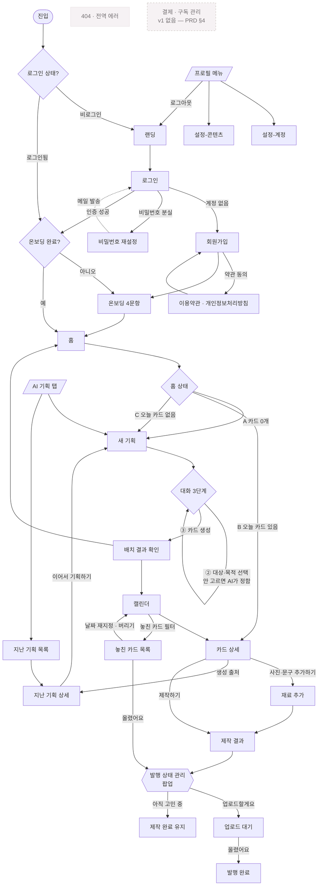

# PLAN.md — 차곡 (Chagok) 기술 설계

최종 수정: 2026-08-27

> **이 문서는 「무엇을 만들 것인가」의 기술 설계다.**
> 기획의 근거·의도는 `PRD.md`, 비주얼 규칙은 `DESIGN.md`에 있다. 여기로 옮겨 적지 않는다.
>
> 근거 표기 — `[PRD]` PRD에 명시됨 · `[IA]` `claude_14-IA-화면구조.md`에 명시됨 ·
> `[추가]` 두 문서에 없지만 동작에 필요해 넣음 · `TODO` 미확정

---

## 1. 서비스 기본

| | |
|---|---|
| **서비스 이름** | 차곡 (Chagok) |
| **한 줄 설명** | 말하면 정리되고, 정리되면 일정이 되고, 일정이 하나씩 콘텐츠로 완성된다 |

**타깃 · 핵심 문제 · 톤앤매너 · 유저 여정 — 자세한 내용은 `PRD.md` 참고.**

---

## 2. 핵심 객체

**3개로 나뉜다.** 저장 주기와 소유 관계가 달라 합칠 수 없다.

| 이름 | 무엇인가 | 왜 분리하나 |
|---|---|---|
| `user` | 계정 + 온보딩 4문항 설정 | 계정당 1개. 카드가 수백 장 쌓여도 이건 1건 |
| `plan` | 기획 세션 — 대화 1회로 확정된 기획안 | 카드 N장의 부모. 「지난 기획」(F10)·「이어서 기획」(F11)의 대상 |
| `card` | 콘텐츠 카드 — 실제 만들고 올리는 단위 | 상태가 4단계로 바뀌고 예정일을 가진다. 발행률의 분모 |

> **기록형 템플릿(F12)을 별도 객체로 만들지 않았다.**
> `[IA]` 2.1이 *"기록형은 여기서 템플릿을 1회 확정한다"*로 기획 대화 안에 두었고,
> 결과물도 「카드 N장」으로 같다. `plan.type`으로 구분한다.

> **구독·결제 객체가 없다.** `[PRD]` §4가 v1에서 결제를 제외했다.

### 2-1. `user`

```ts
/** 계정 + 온보딩에서 받은 콘텐츠 설정. Firestore 문서 ID = Firebase Auth uid */
type User = {
  uid: string;                    // Firebase Auth uid. 문서 ID와 동일
  email: string;                  // 로그인 이메일

  /** 온보딩 2문항 (F1 — 08-28 축소). 말투·피할 표현은 설정-콘텐츠에서 */
  field: string;                  // 활동 분야·주로 만드는 콘텐츠 (예: "홈트레이닝")
  uploadFrequency: number;        // 주당 업로드 목표 횟수. 캘린더 자동 배치(F4)의 간격 계산에 쓴다
  tone: ToneKey | null;           // 말투 — 설정에서 선택. 정하기 전 null → 캡션은 기본 말투
  avoidExpressions: string[];     // 피할 표현. 캡션 생성 시 프롬프트의 금지 목록으로 들어간다

  onboardedAt: Timestamp | null;  // null이면 온보딩 미완료 → 라우트 가드가 /onboarding으로 보낸다
  createdAt: Timestamp;
};

/** 온보딩에서 예시 문장 2~3줄짜리 카드 4종으로 보여주고 고르게 한다 */
type ToneKey = 'friendly' | 'calm' | 'energetic' | 'professional';
// TODO: 4종의 실제 키·예시 문장 미확정. PRD §5-2에 «카드 4종»만 있고 내용은 없음
```

### 2-2. `plan`

```ts
/** 기획 세션. 대화 1회 = plan 1건 → card N장 */
type Plan = {
  id: string;                     // 자동 생성 ID
  userId: string;                 // 소유자 uid

  type: PlanType;                 // 'series' 일반 기획 | 'record' 기록형(F12)

  topic: string;                  // 주제. ① 단계에서 확정
  audiences: string[];            // 대상. ② 단계 멀티 선택 (후보 4~5개 + 기타 직접 입력)
  purposes: string[];             // 목적. ② 단계 멀티 선택
  intent: string;                 // 기획의도. AI가 생성. 카드 상세에서만 노출(DESIGN.md §6)
  seriesTitle: string;            // 시리즈 제목. 놓친 카드 화면(3.1)에서 묶는 기준

  messages: PlanMessage[];        // 대화 히스토리 전문. 「지난 기획 상세」(2.4)에서 그대로 보여준다
  cardCount: number;              // 생성된 카드 수. 하한 1 · 상한 없음

  /** 기록형(type='record')일 때만 채워진다 */
  recordDays: number | null;      // 며칠치를 미리 깔지. TODO: PRD §9 미결 5 — 3개월이면 90장
  templateVarNames: string[];     // 템플릿 변수 이름 목록. 카드 상세에서 입력칸이 자동 렌더링된다

  status: PlanStatus;             // 'draft' 대화 중 | 'confirmed' 확정되어 카드가 생성됨
  createdAt: Timestamp;           // TTV 측정 시작점 (PRD §5-3)
  confirmedAt: Timestamp | null;
};

type PlanType = 'series' | 'record';
type PlanStatus = 'draft' | 'confirmed';

type PlanMessage = {
  role: 'user' | 'assistant';
  text: string;
  createdAt: Timestamp;
};
```

### 2-3. `card`

```ts
/** 콘텐츠 카드 — 만들고 올리는 단위. 발행률의 분모가 된다 */
type Card = {
  id: string;                     // 자동 생성 ID
  userId: string;                 // 소유자 uid. 캘린더 조회의 기준
  planId: string;                 // 생성 출처. 카드 상세 → 「지난 기획 상세」(2.4)로 이동

  title: string;                  // 카드 주제 (전체 길이)
  shortTitle: string;             // 12자 내외. 캘린더 월간 칸이 좁아 원 제목은 6~9자에서 잘린다
  audience: string;               // 이 카드가 겨냥한 대상 1개 (plan.audiences 중 하나)
  intent: string;                 // 기획의도. 카드 상세에서만 노출

  scheduledDate: string;          // 예정일 'YYYY-MM-DD'. 캘린더 배치(F4)가 부여, 드래그로 변경
  status: CardStatus;             // 아래 상태 모델 참고
  publishIntent: PublishIntent;   // status와 별개 필드 (DESIGN.md §11)

  visualType: VisualType;         // 이미지 폴백 사슬의 판정 결과 (DESIGN.md §12)
  photoUrls: string[];            // 사용자가 올린 사진. 순서 = 배열 순서 (F13)
  extraNote: string;              // «이번에 꼭 넣을 내용» 자유 입력 (F13)
  templateVars: Record<string, string>; // 기록형의 그날 값. plan.templateVarNames와 짝을 이룬다

  caption: Caption | null;        // 캡션 생성(F7) 전에는 null
  slides: Slide[];                // 카드뉴스 5~8장 (F8). 생성 전에는 빈 배열

  createdAt: Timestamp;
  updatedAt: Timestamp;
  publishedAt: Timestamp | null;  // 「올렸어요」를 누른 시각. 발행률 집계의 근거
};

/**
 * 기획 완료 → 제작 완료 → 업로드 대기 → 발행 완료
 *     └───────────┴────────────┴──────→ 버림 (어느 단계에서든)
 *
 * 「제작 중」은 없다. 렌더링이 0.05초라 로딩이지 상태가 아니다 (DESIGN.md §11).
 * overdue도 상태가 아니다 — scheduledDate < today && status != 'published' 로 계산한다.
 */
type CardStatus = 'planned' | 'crafted' | 'pending' | 'published' | 'discarded';

/** status와 합치면 「제작 완료」가 '아니오'와 '미응답' 둘을 뜻하게 되어 분모가 흐려진다 */
type PublishIntent = null | 'yes' | 'no';

type VisualType = 'user_photo_preferred' | 'stock_recommended' | 'text_only';

type Caption = {
  hook: string;                   // 첫 문장
  body: string;
  cta: string;
  hashtags: string[];             // 칩으로 표시 · 삭제·추가 가능
};

type Slide = {
  order: number;                  // 0부터. 순서 변경 시 이 값을 다시 매긴다
  layoutId: LayoutId;             // 레이아웃 6종 중 하나
  texts: Record<string, string>;  // 레이아웃의 텍스트 슬롯별 내용. 글자 «내용»만 수정 가능
  imageUrl: string | null;        // 'text-only'면 null
};

/**
 * 카드뉴스 레이아웃 6종 `[확정 08-27]`
 *
 * 사용자가 6종 중 «고르는» 것만 가능하고 직접 만들 수는 없다 (DESIGN.md §12).
 * 각 레이아웃이 어떤 텍스트 슬롯을 갖는지는 시안이 나와야 확정된다 — 아래 TODO.
 */
type LayoutId =
  | 'cover'       // 표지 — 첫 장. 캡션의 hook을 크게 싣는다
  | 'text-only'   // 글자만. 이미지 폴백 3순위의 착지점 (DESIGN.md §12)
  | 'image-top'   // 위 이미지 + 아래 글
  | 'image-full'  // 전면 이미지 + 오버레이 글
  | 'list'        // 번호 목록 — «3가지 이유» 같은 구조
  | 'closing';    // 마무리 — 캡션의 cta·팔로우 유도

// TODO: 각 레이아웃의 texts 슬롯 키와 여백·글자 크기·이미지 비율은 시안이 나와야 정해진다.
//       DESIGN.md §18 참조. 이름이 확정됐으므로 렌더러 골격은 먼저 짤 수 있다.
```

---

## 3. 기능 정의

> **이용 범위** — `[PRD]` §4·§5-3·§5-5가 *"v1은 전체 무료. 유료 구분 없음"*으로 확정했다.
> 그래서 사용자 기능은 전부 **「전체 무료(v1)」**이고, 유료 전용은 하나도 없다.
> v2에 과금이 붙으면 이 열을 다시 채운다 (`PRD.md` §10-6).

| 기능 | 설명 | 관련 화면 | 관련 핵심 객체 | MVP 범위 | 이용 범위 | 예외/실패 시 처리 |
|---|---|---|---|---|---|---|
| **회원가입** `[추가]` | 이메일·비밀번호로 계정 생성 · 약관 동의 | 회원가입 | `user` | 포함 | 전체 무료 | 이메일 중복·형식 오류 → 입력 아래 인라인 안내. **비밀번호 8~20자, 조합 자유** |
| **로그인** `[추가]` | 이메일·비밀번호 인증 · 자동 로그인 유지 | 로그인 | `user` | 포함 | 전체 무료 | 인증 실패 → 인라인 안내. **비로그인 사용 불가** (PRD §5-4) |
| **비밀번호 재설정** `[IA]` | 재설정 메일 발송 | 비밀번호 재설정 | `user` | 포함 | 전체 무료 | 미가입 이메일이어도 «메일을 보냈어요»로 동일 응답 (계정 존재 여부 노출 방지) |
| **로그아웃** `[IA]` | 세션 종료 | 없음-전역 메뉴 | `user` | 포함 | 전체 무료 | — |
| **온보딩 2문항 (F1)** `[08-28 축소]` | 활동 분야 · 업로드 빈도. 60초 — 말투·피할 표현은 설정-콘텐츠로 이동 | 온보딩 | `user` | 포함 | 전체 무료 | 미완료 상태로 이탈 → 다음 로그인 시 다시 온보딩으로 |
| **온보딩 가드** `[추가]` | `onboardedAt`이 null이면 다른 화면 접근 차단 | 없음-백엔드 로직 | `user` | 포함 | 없음(백엔드) | — |
| **AI 기획 대화 (F2)** | 3단계 — ①주제 확인(필요시, 후보 4개·열린 질문 금지) → ②대상·목적 선택 → ③카드 생성 | 새 기획 | `plan` | 포함 | 전체 무료 | 5초 초과 → 대기 문구 유지. 실패 시 **자동 1회 재시도** → 말풍선 자리에 인라인 + `[다시 보내기]`. 이전 대화는 계속 읽을 수 있다 |
| **시리즈 분해 · 카드 생성 (F3)** | 주제 × 대상 → 카드 N장 (하한 1 · 상한 없음) | 새 기획 | `plan` `card` | 포함 | 전체 무료 | **원자성 — 전부 성공하거나 전부 취소.** 일부 실패 시 이미 만든 카드를 되돌리고 캘린더에 아무것도 남기지 않는다 |
| **short_title 생성** `[DESIGN.md §8]` | 캘린더 칸용 12자 내외 제목을 카드 생성 시 함께 생성 | 없음-백엔드 로직 | `card` | 포함 | 없음(백엔드) | 12자 초과 시 잘라 쓰되 원 제목은 보존 |
| **캘린더 자동 배치 (F4)** | `user.uploadFrequency`에 맞춰 예정일 부여 | 배치 결과 확인 · 캘린더 | `card` `user` | 포함 | 전체 무료 | 같은 날 몰림 방지. **TODO: 배치 규칙(요일 선호·최소 간격) 미확정** |
| **오늘의 카드 (F5)** | 오늘 예정 카드 **1건만** 노출 | 홈 | `card` | 포함 | 전체 무료 | 오늘 카드 없음 → 홈 상태 C. 카드 0개 → 홈 상태 A (DESIGN.md §9) |
| **카드 상세 · 생성 출처 (F6)** | 기획 정보 확인·수정 · 원 기획 세션으로 이동 | 카드 상세 | `card` `plan` | 포함 | 전체 무료 | 원 `plan` 삭제됨 → 출처 링크 숨김 |
| **캡션 생성 (F7)** | Hook · Body · CTA · Hashtag | 제작 결과 | `card` | 포함 | 전체 무료 | 생성 실패 → 해당 영역 인라인 표시 + 다시 만들기 |
| **템플릿형 카드뉴스 (F8)** | 슬라이드 5~8장 · 레이아웃 6종 · 이미지 폴백 사슬 | 제작 결과 | `card` | 포함 | 전체 무료 | 사진 없으면 스톡 → 없으면 text_only. **어디서 멈춰도 완성된다** |
| **발행 상태 관리 (F9)** | 발행 의향 1문항 → 업로드 대기 → 발행 완료 | 발행 상태 관리(팝업) | `card` | 포함 | 전체 무료 | 「올렸어요」를 안 누르면 미발행으로 집계 → F14가 회수 |
| **확정 기획 세션 조회 (F10)** | 지난 기획 목록·상세 · 대화 히스토리 전문 | 지난 기획 목록 · 지난 기획 상세 | `plan` | 포함 | 전체 무료 | 0건 → empty state |
| **이어서 기획하기 (F11)** | 지난 기획을 이어받아 새 대화 시작 | 지난 기획 상세 | `plan` | 포함 *(Should)* | 전체 무료 | **TODO: 중복 방지 — 과거 카드를 프롬프트에 몇 개까지 넣을지 미확정 (PRD §9 미결 4)** |
| **기록형 카드 (F12)** | 템플릿 1회 확정 → 기간만큼 매일 자동 생성 | 새 기획 | `plan` `card` | 포함 | 전체 무료 | **TODO: 몇 개월치까지 미리 깔지 미확정 (PRD §9 미결 5)** |
| **기획안 업데이트 (F13)** | 사진 여러 장 · 템플릿 변수 · 이번에 꼭 넣을 내용 | 재료 추가 | `card` | 포함 | 전체 무료 | 사진 업로드 실패 → 해당 사진만 인라인 표시, 나머지는 유지 |
| **놓친 카드 모아보기 (F14)** | 예정일 지났는데 미발행인 카드를 시리즈별로 | 놓친 카드 목록 | `card` | 포함 | 전체 무료 | 0건 → **죄책감 아닌 문구로** empty state (빨간색·경고 금지) |
| **overdue 계산** `[DESIGN.md §11]` | `scheduledDate < today && status != 'published'` | 없음-백엔드 로직 | `card` | 포함 | 없음(백엔드) | 별도 status를 만들지 않는다 |
| **예정일 변경** `[IA]` | 캘린더 드래그 · 놓친 카드 재지정 · 카드 상세 수정 | 캘린더 · 놓친 카드 목록 · 카드 상세 | `card` | 포함 | 전체 무료 | 저장 실패 → 원위치 + Toast |
| **카드 버리기** `[IA]` | status를 'discarded'로. **삭제가 아니다** | 카드 상세 · 놓친 카드 목록 | `card` | 포함 | 전체 무료 | 되돌릴 수 없으므로 확인 모달 |
| **콘텐츠 설정 수정** `[IA]` | 온보딩 4문항 값 변경 · 이후 생성물부터 반영 | 설정-콘텐츠 | `user` | 포함 | 전체 무료 | 저장 실패 → 인라인 표시 |
| **회원 탈퇴** `[IA]` | 계정 + 데이터 삭제 | 설정-계정 | `user` `plan` `card` | 포함 | 전체 무료 | **TODO: 삭제 범위·보관 기간 미확정 (§10)** |
| **랜딩** `[PRD §5-1]` | 제품 소개 · 테스트 참가자 컨텍스트 전달 | 랜딩 | 없음 | 포함 | 전체 무료 | 정적 페이지 |
| ~~자동·예약 발행~~ | | | | **제외** | — | `[PRD]` §4 — 검증 질문을 흐린다 |
| ~~인스타 계정 연동~~ | | | | **제외** | — | `[PRD]` §4 — 따라서 성과 분석도 불가 |
| ~~이미지 보정·합성·편집기~~ | | | | **제외** | — | `[PRD]` §4 — Canva 영역 |
| ~~AI 이미지 생성~~ | | | | **제외** | — | `[PRD]` §4 — v2 |
| ~~결제·요금제~~ | | | | **제외** | — | `[PRD]` §4 — v1 전체 무료 |
| ~~알림·리마인더~~ | | | | **제외** | — | `[IA]` v1 제외 |

---

## 3-1. 기능 상세 명세

> MVP 범위가 「제외」인 것은 뺐다.

| 기능명 | 트리거 | 입력값 | 처리 로직 | 출력/결과 | 예외 처리 |
|---|---|---|---|---|---|
| 회원가입 | `[가입하기]` 클릭 | 이메일 · 비밀번호 · 약관 동의 여부 | Firebase Auth 계정 생성 → `user` 문서 생성(`onboardedAt: null`) | 온보딩 화면으로 자동 이동 | 중복 이메일·약한 비밀번호 → 해당 입력 아래 인라인 |
| 로그인 | `[로그인]` 클릭 · 앱 재진입 | 이메일 · 비밀번호 | Firebase Auth 인증 → 세션 유지(자동 로그인) | `onboardedAt`이 null이면 온보딩, 아니면 홈 | 인증 실패 → 인라인. 재시도 횟수 제한 없음 |
| 비밀번호 재설정 | `[비밀번호를 잊으셨나요]` | 이메일 | Firebase Auth 재설정 메일 발송 | «메일을 보냈어요» 안내 | 미가입 이메일도 **같은 문구**로 응답 |
| 로그아웃 | 프로필 메뉴 → `[로그아웃]` · **설정-계정 `[로그아웃]`** | 없음 | 세션 종료 | 랜딩으로 이동 | — |
| 온보딩 2문항 (F1) | 가입 직후 · 미완료 상태 로그인 | 활동분야(텍스트) · 빈도(숫자 1~7) | `user` 문서에 저장 → `onboardedAt` 기록 (서버 PATCH `/api/users/me`) | 홈 상태 A로 이동 | 중간 이탈 시 저장 안 함 → 다음 진입에 처음부터 |
| 온보딩 가드 | 보호된 화면 진입 | 없음 (세션의 uid) | `user.onboardedAt`을 확인 | null이면 온보딩으로 리다이렉트 | `user` 문서 없음 → 로그아웃 처리 |
| AI 기획 대화 (F2) | 「아이디어 말하기」 · 새 기획 진입 | 자유 텍스트 · ②단계 대상·목적 선택 · 기획안 카드 부분 수정 | 서버 API로 AI 호출 → `plan`(status:'draft')에 `messages` 누적. ①은 주제가 전혀 없을 때만 — 후보 4개 제시(열린 질문 금지). ②에서 고르지 않으면 **AI가 알아서 정하고 넘어간다** | 대화 말풍선 · 기획안 패널 실시간 갱신 | 5초 초과 → 대기 문구 유지. 실패 시 자동 1회 재시도 → 인라인 + `[다시 보내기]` |
| 시리즈 분해 · 카드 생성 (F3) | ③단계 진입 | `plan.topic` · `audiences` · `purposes` | 주제 × 대상 조합 → `card` N장 생성, `plan.status='confirmed'` `cardCount` 기록 | 배치 결과 화면으로 이동 | **원자성** — 일부 실패 시 생성분을 전부 되돌린다. `plan.status`도 'draft'로 유지 |
| short_title 생성 | 카드 생성과 동시 | `card.title` | AI가 12자 내외 축약본 생성 | `card.shortTitle` 저장 | 초과 시 잘라 쓰되 `title`은 보존 |
| 캘린더 자동 배치 (F4) | 카드 생성 직후 | `user.uploadFrequency` · 카드 수 | 빈도에 맞춰 `scheduledDate` 부여 | 「N개의 콘텐츠가 일정에 추가됐어요」 + 날짜 목록 | **TODO: 배치 규칙(요일 선호·최소 간격) 미확정** |
| 오늘의 카드 (F5) | 홈 진입 | 없음 (uid · 오늘 날짜) | `scheduledDate == today && status != 'discarded'` 조회 → **1건만** | 상태 B: Featured Card + `[제작하기]` | 0건 → 상태 C. 전체 0개 → 상태 A |
| 카드 상세 · 생성 출처 (F6) | 홈·캘린더에서 카드 클릭 | `cardId` | `card` 조회 + `planId`로 출처 링크 | 기획 정보 + `[제작하기]` `[사진·문구 추가하기]` | 카드 없음 → 404. 원 `plan` 없음 → 출처 숨김 |
| 캡션 생성 (F7) | `[제작하기]` 클릭 | `card` 기획 정보 · `user.tone` · `avoidExpressions` | 서버 API로 AI 호출 → `Caption` 생성 | Hook·Body·CTA·해시태그 칩 | 자동 1회 재시도 → 해당 영역 인라인 + `[다시 만들기]`(보조 버튼). **글자 직접 수정이 기본 경로** |
| 템플릿형 카드뉴스 (F8) | `[제작하기]` 클릭 (캡션과 함께) | `card` 정보 · `photoUrls` · `extraNote` · `templateVars` | 이미지 폴백 사슬로 `visualType` 판정 → 렌더링 요청 → `slides` 저장, `status='crafted'` | skeleton 3장 → 순차 reveal | 사진 없으면 스톡 → 없으면 text_only. **어디서 멈춰도 완성** |
| 발행 상태 관리 (F9) | 제작 완료 후 · 홈 `[업로드하셨나요?]` | 의향 1문항 응답 | 「업로드할게요」 → `publishIntent='yes'`, `status='pending'` / 「고민 중」 → `publishIntent='no'`, status 유지. 「올렸어요」 → `status='published'`, `publishedAt` 기록 | 상태 배지 갱신 | 저장 실패 → Toast + 원상 복구 |
| 확정 기획 세션 조회 (F10) | AI 기획 탭 → `[지난 기획]` | 없음 (uid) | `plan` where `status='confirmed'` 최신순 | 주제·확정일·카드 수·진행 상태 목록 | 0건 → empty state |
| 이어서 기획하기 (F11) | 지난 기획 상세 → `[이어서 기획하기]` | `planId` | 기존 `messages`를 컨텍스트로 새 대화 시작 | 새 기획 화면(이전 맥락 로드됨) | **TODO: 과거 카드 몇 개까지 프롬프트에 넣을지 미확정** |
| 기록형 카드 (F12) | 대화에서 기록형으로 판정 | 템플릿 예시 핑퐁 · 기간 | `plan.type='record'` · `templateVarNames` 확정 → 기간만큼 매일 `card` 생성 | 배치 결과 화면 | **TODO: 최대 기간 미확정. 3개월이면 90장** |
| 기획안 업데이트 (F13) | 카드 상세 → `[사진·문구 추가하기]` | 사진 파일 여러 장 · 자유 텍스트 · 템플릿 변수 값 | Storage 업로드 → `photoUrls` · `extraNote` · `templateVars` 저장 | `[제작하기]`로 진행 | 개별 사진 실패 → 그 사진만 인라인 표시, 나머지 유지 |
| 놓친 카드 모아보기 (F14) | 캘린더 → 놓친 카드 필터 | 없음 (uid · 오늘 날짜) | overdue 조건으로 조회 → `plan.seriesTitle`로 묶기 | 시리즈별 목록 + 올렸어요·날짜 재지정·버리기 | 0건 → 죄책감 없는 문구 (빨간색·경고 금지) |
| overdue 계산 | 캘린더·놓친 카드 렌더링 시 | `scheduledDate` · `status` · 오늘 날짜 | `scheduledDate < today && status != 'published'` | UI에 표시만 | 별도 status를 만들지 않는다 |
| 예정일 변경 | 드래그 · 날짜 재지정 · 상세 수정 | 새 날짜 | `card.scheduledDate` 갱신 | 캘린더 즉시 반영 + Toast | 실패 → 원위치 + Toast |
| 카드 버리기 | `[버리기]` 클릭 | `cardId` | `status='discarded'`. **문서를 지우지 않는다** | 목록에서 제외, 발행률 분모에는 남음 | 되돌릴 수 없으므로 확인 모달 |
| 콘텐츠 설정 수정 | 설정-콘텐츠에서 저장 | 온보딩 4문항과 동일 | `user` 문서 갱신 | Toast «저장됐어요» · **이후 생성물부터 반영** | 저장 실패 → 인라인 |
| 회원 탈퇴 | 설정-계정 → `[회원 탈퇴]` | 확인 입력 | Auth 계정 삭제 + 데이터 삭제 | 랜딩으로 이동 | **TODO: 삭제 범위·유예 기간 미확정** |
| 랜딩 | URL 직접 진입 · 비로그인 상태로 `/` | 없음 | 정적 렌더링 | 제품 소개 + `[시작하기]` | — |

---

## 4. 화면 목록

**총 19개.** 1단계(기능 표에서 수집) 15개 + 2단계(기본 확인 목록) 3개 + 3단계(구조적 특성) 1개.

| 화면 이름 | 라우트(제안) | 목적 | 로그인 필요 | 추가 근거 |
|---|---|---|---|---|
| 랜딩 | `/` *(비로그인 시)* | 제품 소개 · 테스트 참가자 컨텍스트 전달 | ✕ | |
| 로그인 | `/login` | 이메일·비밀번호 인증 | ✕ | |
| 회원가입 | `/signup` | 약관 동의 + 계정 생성 | ✕ | |
| **비밀번호 재설정** | `/login/reset` | 재설정 메일 발송 | ✕ | **3단계에서 추가** — 이메일·비밀번호 로그인이면 비밀번호를 잊은 사용자가 반드시 생긴다. 이게 없으면 계정이 영구 잠긴다 |
| 온보딩 | `/onboarding` | 2문항 · 60초 | ○ | |
| 홈 | `/` *(로그인 시)* | 오늘 할 것 하나만 보여준다 | ○ | |
| 새 기획 | `/plan/new` | AI 기획 대화 3단계 | ○ | |
| 배치 결과 확인 | `/plan/[planId]/result` | 생성된 카드 + 배정된 날짜 확인 | ○ | |
| 지난 기획 목록 | `/plan/history` | 확정된 기획 세션 목록 | ○ | |
| 지난 기획 상세 | `/plan/[planId]` | 대화 히스토리 · 이어서 기획하기 | ○ | |
| 캘린더 | `/calendar` | 월간 뷰 · 드래그 · 상태별 색 | ○ | |
| 놓친 카드 목록 | `/calendar/missed` | 시리즈별 묶음 · 재지정 · 버리기 | ○ | |
| 카드 상세 | `/card/[cardId]` | 기획 정보 + 제작 진입 | ○ | |
| 재료 추가 | `/card/[cardId]/materials` | 사진 · 템플릿 변수 · 꼭 넣을 내용 | ○ | |
| 제작 결과 | `/card/[cardId]/result` | 슬라이드 · 레이아웃 · 캡션 수정 | ○ | |
| 설정-계정 | `/settings/account` | 이메일·비밀번호 변경 · 회원 탈퇴 | ○ | |
| 설정-콘텐츠 | `/settings/content` | 온보딩 4문항 값 수정 | ○ | |
| **이용약관 · 개인정보처리방침** | `/terms` · `/privacy` | 가입 시 동의 대상 · 개인정보 수집 고지 | ✕ | **2단계에서 추가** — `[IA]` 0.2가 «약관 동의»를 요구하는데 약관 문서가 어디에도 없다. 이메일·사진을 수집하므로 처리방침도 필요 |
| **404 / 전역 에러** | `not-found` · `error` | 없는 주소 · 알 수 없는 오류 | ✕ | **2단계에서 추가** |

> **발행 상태 관리(4.3)는 화면이 아니라 팝업이다.** `[IA]`가 팝업으로 명시했고
> `DESIGN.md` §13이 모바일에서 bottom sheet를 우선하라고 한다. 라우트를 주지 않는다.

### 기본 확인 목록 대조 결과

| 항목 | 판정 |
|---|---|
| 결제 실패/성공 결과 화면 | **불필요** — `[PRD]` §4가 v1에서 결제를 제외했다. 결제가 없으므로 결과 화면도 없다 |
| 이용약관 / 개인정보처리방침 | **추가함** — 정기결제는 없지만, 가입 시 약관 동의를 받고 이메일·사진을 수집한다 |
| 404 / 접근 권한 없음 | **404만 추가.** 모든 데이터가 본인 소유라 «권한 없음»이 따로 없다. 남의 카드 주소로 들어오면 조회 결과가 없어 404가 된다 |
| 전역 에러 화면 | **추가함** |

### 구조적 특성에서 도출한 화면

이 서비스의 특성을 먼저 짚었다.

```
① 이메일·비밀번호 로그인이고 소셜 로그인이 없다   → 비밀번호 분실 경로가 반드시 필요
② AI가 결과물을 만들고 과거 것을 다시 본다       → 「지난 기획」이 이미 있다 (F10·2.3·2.4)
③ 자동 발행이 없어 사용자가 직접 눌러야 한다      → 「놓친 카드」가 이미 있다 (F14·3.1)
④ 결제가 없다                                → 구독 관리·결제수단 화면 불필요
⑤ 캘린더가 있고 날짜를 옮긴다                   → 별도 화면 없이 드래그로 처리 (IA 확정)
```

**②③⑤는 이미 IA에 있어 추가하지 않았다.** ④는 해당 없음.
**추가한 것은 ① 하나 — 비밀번호 재설정.**

---

## 5. 화면 흐름



**결제 분기가 없다.** `[PRD]` §4가 v1에서 결제를 제외했으므로 «체험 중 카드 선등록 vs 체험 종료 후 결제» 갈림길 자체가 존재하지 않는다. TODO로도 남기지 않는다 — v2 이슈다 (`PRD.md` §10-6).

### PRD와 다르게 판단한 지점

| | 지점 | PRD·IA | 이 문서의 판단 | 이유 |
|---|---|---|---|---|
| 1 | **랜딩 라우트** | 명시 없음 | `/` 를 **비로그인=랜딩 / 로그인=홈**으로 분기 | 랜딩이 유입 채널이 아니라 소개 자산(PRD §5-1)이라 별도 주소를 팔 이유가 없다. 홈도 `/`가 자연스럽다 |
| 2 | **비밀번호 재설정을 화면으로 승격** | `[IA]` 0.1 안에 한 줄 언급 | 독립 화면 `/login/reset` | 별도 입력·별도 결과 안내가 필요해 로그인 폼 안에서 처리하기 어렵다 |
| 3 | **약관·처리방침 화면 신설** | `[IA]` 0.2가 «약관 동의»만 언급 | `/terms` `/privacy` 추가 | 동의를 받으려면 동의 대상 문서가 있어야 한다 |
| 4 | **이용 범위를 「전체 무료」로 통일** | 템플릿은 «무료+유료 공통 / 유료 전용» | 유료 열을 만들지 않음 | PRD §4·§5-3·§5-5가 v1 전체 무료로 확정. 유료 열을 비워두면 있는 것처럼 읽힌다 |
| 5 | **기록형을 별도 객체로 두지 않음** | `[IA]` F12를 독립 기능으로 기술 | `plan.type='record'`로 흡수 | 확정 장소(2.1)와 결과물(카드 N장)이 일반 기획과 같다 |
| 6 | **`card`를 최상위 컬렉션으로** | 명시 없음 | `users/{uid}` 하위가 아닌 최상위 | 캘린더가 «기간 + 상태»로 조회한다. 서브컬렉션이면 복합 인덱스 구성이 불리하다 (§7) |

> ⚠️ **7. IA와 PRD가 충돌한다 — 임의로 정하지 않았다.**
> `[IA]` 5.1 계정 화면에 **«요금제(무료 · 월 9,900원)»**가 있는데,
> `[PRD]` §4는 **«결제·요금제 v1 제외»**를 `[확정]`으로 못 박았다.
> IA 자신도 *"결제 연동 v1 포함 여부 미정"*이라 적어 두었다.
> **PRD가 `[확정]`이므로 v1 설정-계정에서 요금제 항목을 빼고 설계했다.** 확인 바란다.

---

## 6. API 라우트 목록

> **AI 호출은 전부 서버에서만 한다.** 클라이언트에서 직접 호출하지 않는다 —
> API 키가 브라우저로 새어 나가고, `avoidExpressions` 같은 제약을 우회할 수 있게 된다.

| 메서드 | 경로 | 설명 | 관련 기능 / 핵심 객체 | 인증 필요 |
|---|---|---|---|---|
| POST | `/api/plans` | 기획 세션 생성 (draft) | F2 · `plan` | ○ |
| POST | `/api/plans/[planId]/messages` | 대화 1턴 — **AI 호출** | F2 · `plan` | ○ |
| POST | `/api/plans/[planId]/confirm` | 기획 확정 → **카드 N장 생성 + short_title 생성 (AI)** | F3 · `plan` `card` | ○ |
| POST | `/api/plans/[planId]/schedule` | 업로드 빈도에 맞춰 예정일 배정 | F4 · `card` `user` | ○ |
| POST | `/api/plans/[planId]/continue` | 이전 맥락을 이어 새 대화 시작 | F11 · `plan` | ○ |
| POST | `/api/cards/[cardId]/caption` | 캡션 생성 — **AI 호출** | F7 · `card` `user` | ○ |
| POST | `/api/cards/[cardId]/render` | 카드뉴스 **구성 생성** — 슬라이드 레이아웃·텍스트를 만들어 저장, status→'crafted'. 완성 PNG는 저장하지 않는다 | F8 · `card` | ○ |
| GET | `/api/cards/[cardId]/slides/[order]/image` | 슬라이드 1장을 **요청 시 PNG로 렌더링** — satori + sharp (같은 프로세스 안) | F8 · `card` | ○ |
| PATCH | `/api/cards/[cardId]/content` | 제작 결과 **부분 수정** — 캡션 전체 · 슬라이드 texts만. layoutId·imageUrl·order는 서버가 기존 값 유지(편집 범위 강제, DESIGN.md §12) | F7 F8 수정 · `card` | ○ |
| PATCH | `/api/cards/[cardId]` | 기획 정보·예정일 수정 | F6 · 예정일 변경 · `card` | ○ |
| PATCH | `/api/cards/[cardId]/status` | 발행 의향·발행 완료·버리기 | F9 · 카드 버리기 · `card` | ○ |
| POST | `/api/cards/[cardId]/photos` | 사진 업로드 URL 발급 | F13 · `card` | ○ |
| PATCH | `/api/users/me` | 온보딩 저장 · 콘텐츠 설정 수정 | F1 · 설정 · `user` | ○ |
| DELETE | `/api/users/me` | 회원 탈퇴 — 계정 + 데이터 삭제 | 회원 탈퇴 · `user` `plan` `card` | ○ |

**조회(GET)는 API route를 만들지 않는다.** 홈·캘린더·목록은 Firestore 보안 규칙으로 본인 문서만 읽게 하고 클라이언트 SDK로 직접 읽는다. 라운드트립이 한 번 줄고, 규칙이 이미 같은 보호를 한다.
**예외는 슬라이드 이미지 GET 하나** — Firestore 조회가 아니라 서버 렌더링이라 route가 필요하다.

> `[PRD §6 확정]` **외부 렌더링 서비스를 호출하지 않는다.** satori+sharp가 같은 Node 프로세스에서
> 돌기 때문에 이 route가 곧 렌더러다. 네트워크 왕복이 없어 실패 지점이 하나 줄어든다.

> **완성 PNG는 어디에도 저장하지 않는다 (08-27 확정).** `Slide` 스키마(§2-3)에는 렌더링 결과
> 필드가 없다 — 카드에는 구성(layoutId·texts)만 저장하고, 이미지는 요청 시 즉석 렌더링한다
> (장당 5~10ms 실측, `scripts/render-smoke.ts`). Storage 버킷·Blaze 업그레이드 없이 동작하므로
> 무예산 전제(PRD §6)와 맞는다. 사용자 업로드 사진(F13)은 별개 — Storage가 필요하며 §8 TODO 유지.

---

## 7. 데이터 구조 (Firestore)

| 컬렉션 | 문서 ID 규칙 | 서브컬렉션 | 보안 규칙 메모 |
|---|---|---|---|
| `users` | **Firebase Auth uid** | 없음 | 본인(`uid == request.auth.uid`)만 읽기·쓰기. `onboardedAt`은 **서버만 쓰기** (08-27 확정 — 온보딩 저장이 어차피 `PATCH /api/users/me`를 거친다) |
| `plans` | 자동 생성 ID | `messages` *(대화가 길어지면 분리)* | `userId == request.auth.uid`인 문서만. `status`·`cardCount`는 **서버만 쓰기** |
| `cards` | 자동 생성 ID | 없음 | `userId == request.auth.uid`인 문서만. `slides`·`caption`은 **서버만 쓰기**(AI 생성물). `status`·`publishIntent`·`scheduledDate`는 클라이언트 쓰기 허용 |

**`cards`를 `users` 하위 서브컬렉션으로 두지 않았다.** 캘린더가 «uid + 기간 + 상태»로 조회하는데, 서브컬렉션이면 컬렉션 그룹 쿼리가 필요해 인덱스 구성이 불리하다.

**`plan.messages`는 일단 문서 안 배열로 둔다.** 대화가 길어져 문서 1MB 한도에 가까워지면 서브컬렉션으로 옮긴다. TODO: 턴 수 상한 미확정.

### 필요한 인덱스

```
cards  (userId ASC, scheduledDate ASC)                 홈 「오늘의 카드」 · 캘린더 월간 조회
cards  (userId ASC, status ASC, scheduledDate ASC)     놓친 카드(overdue) · 상태별 필터
cards  (userId ASC, planId ASC, scheduledDate ASC)     배치 결과 확인 · 시리즈 묶기
plans  (userId ASC, status ASC, confirmedAt DESC)      지난 기획 목록
```

### 보안 규칙에서 특히 신경 쓸 것

```
① 본인 데이터만 — 모든 컬렉션에 userId 검사. (08-27: firestore.rules 작성 완료 —
   전면 차단에서 컬렉션 3개를 열었다. 새 컬렉션을 열 때마다 이 조건을 붙인다)
② AI 생성 필드는 서버만 쓰기 — slides · caption · intent · shortTitle
   클라이언트가 쓸 수 있으면 «AI가 만들었다»는 전제가 깨진다
③ status는 클라이언트 쓰기를 허용하되 값 검증 — 정해진 5개 값만,
   published로 갈 때 publishedAt이 함께 기록되는지 확인
④ 버림은 삭제가 아니다 — cards 문서 delete를 막는다. discarded로만 바뀌어야
   발행률 분모가 유지된다 (DESIGN.md §11)
⑤ onboardedAt은 서버만 쓰기 — 라우트 가드의 근거라 클라이언트가 임의로 못 쓴다.
   온보딩 저장은 PATCH /api/users/me(서버)가 담당 (08-27 확정)
⑥ cards create는 서버만 — 카드는 기획 확정 API(confirm)가 AI로 생성한다.
   클라이언트가 만들 경로가 없다 (08-27 확정)
⑦ users·plans도 클라이언트 delete 금지 — v1에 삭제 기능이 없고,
   탈퇴 시 삭제는 서버(DELETE /api/users/me)가 한다 (08-27 확정)
```

---

## 8. 기술 스택

| | |
|---|---|
| **프레임워크** | Next.js 16.3 (App Router) |
| **언어** | TypeScript 5 |
| **백엔드 / DB / 인증** | Firebase — Auth(이메일·비밀번호) · Firestore |
| **스토리지** | Firebase Storage — 사용자 사진 업로드용. **TODO: 아직 버킷 미생성. 신규 프로젝트는 Blaze 필요할 수 있음** |
| **배포** | Firebase App Hosting — GitHub push 자동 배포 · Secret Manager. **TODO: Blaze 업그레이드 필요** |
| **스타일** | Tailwind CSS 4 + `DESIGN.md` 토큰 (`globals.css`) |
| **폰트** | Pretendard 단일. **UI는 dynamic-subset CDN, 렌더러는 `.ttf` 파일 직접 포함** — satori는 시스템 폰트를 읽지 못하고 폰트 버퍼를 넘겨받는다 |
| **아이콘** | lucide-react. **TODO: 아직 미설치** |
| **AI** | **Anthropic Claude `claude-opus-5`** · `@anthropic-ai/sdk`. **TODO: 패키지 미설치 — 착수 시점에 허락을 구한다** |
| **상태 관리** | 별도 라이브러리 없이 React 내장 + Firestore 실시간 구독으로 시작. 부족해지면 재검토 |
| **결제 연동** | 없음 — v1 결제 제외 |
| **카드뉴스 렌더링** | **satori** (HTML→SVG) + **sharp** (SVG→PNG). App Hosting 안에서 실행 · 배포 대상 1개 유지. **TODO: 두 패키지 미설치 — `CLAUDE.md` 「의존성」 규칙에 따라 F8 착수 시점에 허락을 구한다** |

### 타겟 디바이스 / 화면 크기

**모바일 웹 우선 · 데스크톱까지 지원한다.** 모바일 전용이 아니다.

```
Mobile   < 768      하단 탭 3개 · 페이지 패딩 16     ← 우선 설계 기준
Tablet   768~1199   사이드바 아이콘만(72) · 패딩 24
Desktop  >= 1200    사이드바 240 · 패딩 32
```

**왜 모바일 우선인가** — `[PRD]` §2가 *"막히는 순간은 대부분 폰 앞이다 — 러닝 중, 퇴근길, 매장 정리 중"*이라고 못 박았다.

**왜 데스크톱도 버리지 않는가** — `DESIGN.md` §4가 세 구간의 내비게이션과 최대 폭을 전부 정의했고,
§7이 AI 대화 화면의 2단 구성(`>= 1280`)을 규정했다. 제작 작업은 화면이 넓을수록 유리하다.

**이 값이 다른 섹션에 적용된 방식**

| 섹션 | 반영 |
|---|---|
| 4. 화면 목록 | 발행 상태 관리를 라우트 없는 팝업으로 둠 — 모바일에서 bottom sheet가 되어야 해서 |
| 5. 화면 흐름 | GNB 3개(홈·AI기획·캘린더)를 흐름의 상시 진입점으로. 모바일 하단 탭과 동일 구조 |
| 8. 반응형 | 단순 축소가 아니라 **정보 구조 재배치** — 캘린더는 모바일에서 «월간 grid + 선택 날짜 리스트»로 바뀐다 |

---

## 9. AI 호출

| | |
|---|---|
| **어떤 모델** | **Anthropic Claude — `claude-opus-5`** `[PRD §6 확정]`. SDK는 `@anthropic-ai/sdk`. 단가 입력 $5 / 출력 $25 (1M 토큰당) |
| **키 관리** | `ANTHROPIC_API_KEY` — 서버 전용. **`NEXT_PUBLIC_` 금지** (`CLAUDE.md` 보안 2). 배포는 Secret Manager |
| **구조화 출력** | 대상 후보 4~5개·카드 배열을 **JSON 스키마로 강제**한다. 자유 텍스트를 파싱하면 형식이 조금만 흔들려도 F3가 통째로 실패한다 |
| **호출 위치** | 서버 API route에서만 (§6). 클라이언트 직접 호출 금지 |
| **오래 걸릴 때 화면** | `DESIGN.md` §10 — 화면을 막지 않고 결과가 생길 영역만 로딩. 대기 문구 **최대 2단계**. 카드뉴스는 skeleton 3장 → 순차 reveal |
| **실패 / 시간 초과** | `[PRD §5-7 확정]` **자동 1회 재시도 → 실패하면 사용자가 누른다.** 결과 불만족은 **부분 수정이 기본**이고 `[다시 만들기]`는 보조. 카드 N장 생성은 **전부 성공하거나 전부 취소**. 재시도 횟수 제한은 v1에 없음 |
| **무료 사용자도 호출하는가** | **예. v1은 전체 무료라 구분이 없다.** 호출 횟수 제한도 없다 |
| **5초 제약과의 관계** | 이 모델은 **사고가 기본 활성**이라 지연이 늘 수 있다. 완화 수단 ① 노력 수준을 작업별로 조절 ② 스트리밍으로 첫 글자를 빨리 띄움. **TODO: 실측 후 결정 (위험 3)** |

> **TODO: 호출량 상한이 없다.** v1은 5인 관찰이라 문제가 안 되지만, 공개하면 비용 방어 장치가 필요하다.

---

## 10. 후속 관리

| | |
|---|---|
| **재방문 트리거** | 오늘의 카드(F5) · 기록형의 매일 채울 칸(F12) · 놓친 카드(F14). **푸시·이메일 알림은 v1 없음** |
| **히스토리로 저장할 것** | `plan` 대화 히스토리 전문 · 확정 기획안 / `card` 전체(버린 것 포함 — 발행률 분모) |
| **보관 기간** | **TODO — 미확정.** 자동 삭제 정책이 없다 |
| **삭제 가능 여부** | 카드는 **버리기(`discarded`)만 가능하고 삭제는 불가.** 지우면 발행률 분모가 흔들려 성적 조작이 된다 (`DESIGN.md` §11)<br>계정 단위 삭제는 회원 탈퇴로 가능. **TODO: 탈퇴 시 삭제 범위·유예 기간 미확정** |

---

## 11. 변경 이력

| 날짜 | 변경 내용 | 이유 | 관련 섹션 |
|---|---|---|---|
| 2026-08-27 | 최초 작성 | PRD·IA·DESIGN 기준 기술 설계 수립 | 전체 |
| 2026-08-27 | AI 실패·재시도 처리 확정 | PRD §5-7 신설에 따름. F2·F3 화면 확정을 막던 TODO 해소 | §3 · §3-1 · §9 · §12 |
| 2026-08-27 | 렌더링을 Node(satori+sharp)로 확정 | 언어를 하나로 유지해야 3인이 서로의 코드를 본다(위험 7). 배포 대상도 1개 유지 | §6 · §8 · §12 |
| 2026-08-27 | AI 모델을 Anthropic Claude로 확정 | 한국어 기획 대화 품질이 제품의 전부(PRD §3). 구조화 출력으로 F3 파싱 실패를 차단 | §8 · §9 · §12 |
| 2026-08-27 | 보안 규칙 3건 확정 — `onboardedAt` 서버만 쓰기 · `cards` create 서버만 · `users`/`plans` 클라이언트 delete 금지 | firestore.rules 구현 중 미확정이던 지점을 결정(승인받음). 규칙 파일과 문서를 일치시킴 | §7 |
| 2026-08-27 | 렌더링 산출물 무저장 확정 — 완성 PNG는 저장하지 않고 요청 시 렌더링. 슬라이드 이미지 GET route 신설 | Slide 스키마에 렌더링 결과 필드가 없고, Node 실측 5~10ms/장이라 저장·관리보다 즉석 렌더링이 싸다. Storage·Blaze 불필요(승인받음) | §6 |
| 2026-08-27 | 제작 결과 수정 route `/content` 신설 — caption·slides는 클라이언트 쓰기가 막힌 AI 필드라 «부분 수정»(PRD §5-7)도 서버 경유가 필요 | 기존 PATCH `/api/cards/[cardId]`(기획 정보·예정일)와 분리 — AI 산출물 수정은 편집 범위 강제 등 검증이 다르다(승인받음) | §6 |
| 2026-08-27 | 레이아웃 6종 이름 확정 (`LayoutId`) | 이름은 렌더러 «구조»를, 시안은 그 «안»을 정한다. 나눠도 충돌하지 않고 F8 착수를 막지 않는다 | §2-3 · §12 |
| 2026-08-27 | F2 ②단계를 «후보 선택 폼» → «AI 선제 제안 + 기획안 카드 부분 수정»으로 변경 | 선택 피로 최소화 — AI decides first, user confirms (DESIGN §1). 사용자 확정 지시 | §2-2 · §3 · §3-1 · §5 |
| 2026-08-27 | F2를 IA 원안으로 복원 — ①주제 후보 4개(열린 질문 금지) · ②대상·목적 후보 멀티선택+기타 입력. 기획안 카드 부분 수정은 보조로 유지 | 사용자가 IA(claude_14) 첨부로 원안 확정. 직전 변경을 되돌림 | §2-2 · §3 · §3-1 · §5 |
| 2026-08-28 | 비밀번호 규칙 확정 — 8자 이상 64자 이하, 조합 강제 없음. 로그인은 규칙 검사 없음(기존 계정 보호) | NIST SP 800-63B(2025) 길이 우선 권고. 3안 제시 후 사용자 확정 | §2 기능 목록 |
| 2026-08-28 | 비밀번호 규칙 수정 — 상한 64자 → 20자 (8~20자, 조합 자유). 회원가입에 입력 중 실시간 안내 추가 | 사용자 확정 | §2 기능 목록 |
| 2026-08-28 | 로그아웃 버튼을 설정-계정 화면 작업 범위에 포함 | 로그아웃 경로가 아직 없음 — 설정 페이지 작업자에게 코드 TODO로 전달 | §2 · §4 |
| 2026-08-28 | 온보딩을 2문항으로 축소 — 말투·피할 표현은 설정-콘텐츠로 이동. `User.tone`은 미설정(null) 허용, 온보딩 완료 시 서버가 tone=null·avoidExpressions=[] 기본값 기록 | PRD §10 미결 8의 ⓒ 채택(사용자 확정) — 말투 예시 문장 미확정·첫 체감 미기여 문제 해소. **PRD §5-2([확정] 4문항)·§10-8은 사람이 갱신 필요** | §2 · §3 · §4 · §6 |

> **코딩 중 이 문서를 수정하게 되면 반드시 이 표에 기록한다.** (`CLAUDE.md` 「우선순위 및 충돌 처리」 3번)

---

## 12. 미확정 / 리스크 (TODO 모음)

### 설계를 막고 있는 것 (우선순위 높음)

| | 항목 | 무엇을 막고 있나 | 출처 |
|---|---|---|---|
| ~~1~~ | ~~AI 실패·재시도 처리 방식~~ | ✅ **해소 (08-27)** — `PRD.md` §5-7 확정 | `PRD.md` §10-9 |
| ~~2~~ | ~~Python 렌더러 실행 위치~~ | ✅ **해소 (08-27)** — Node(satori+sharp)로 재작성 확정 | `PRD.md` §10-11 |
| 2-1 | **렌더링 성능 재측정** | 스파이크의 «5장 0.05초»는 Pillow 기준이라 무효. Node로 실측 필요 | `PRD.md` §6 |
| ~~3~~ | ~~AI 모델·제공사~~ | ✅ **해소 (08-27)** — Anthropic Claude `claude-opus-5` | `PRD.md` §6 |
| 3-1 | **응답 시간 실측 + 노력 수준·스트리밍 결정** | 「1턴 5초 이내」 달성 여부. 사고가 기본 활성이라 그대로는 넘길 수 있다 | `PRD.md` 위험 3 |
| 3-2 | **경량 작업 모델 분리 여부** | `short_title`을 `claude-haiku-4-5`로 내릴지. 재시도 제한이 없어 비용 차가 벌어질 수 있다 | `PRD.md` §6 |
| ~~4~~ | ~~레이아웃 6종의 실제 ID~~ | ✅ **해소 (08-27)** — `LayoutId` 유니온 6종 확정 (§2-3) | `DESIGN.md` §18 |
| 4-1 | **레이아웃 6종의 시안** | 각 레이아웃의 `texts` 슬롯 키 · 여백 · 글자 크기 · 이미지 비율. **렌더러 골격은 먼저 짤 수 있다** | `DESIGN.md` §18 |

### 값이 비어 있는 것

| | 항목 | 출처 |
|---|---|---|
| 5 | 말투 4종의 키·예시 문장 | `PRD.md` §5-2 |
| 6 | 캘린더 배치 규칙 (요일 선호·최소 간격) | 미명시 |
| 7 | 기록형 최대 기간 (3개월이면 90장) | `PRD.md` §9 미결 5 |
| 8 | 재기획 시 중복 방지 — 과거 카드를 프롬프트에 몇 개까지 | `PRD.md` §9 미결 4 |
| 9 | 무료 스톡 provider · 이미지 적합도 기준선 | `PRD.md` §9 미결 2·3 |
| 10 | 에러 색상 `--warn` 확정 | `DESIGN.md` §2 |
| 11 | 대화 턴 수 상한 (`plan.messages` 문서 크기) | §7 |
| 12 | 히스토리 보관 기간 · 탈퇴 시 삭제 범위 | §10 |
| 13 | AI 호출량 상한 (공개 시 비용 방어) | §9 |

### 확인이 필요한 충돌

| | 항목 |
|---|---|
| 14 | **IA 5.1 «요금제(무료·월 9,900원)» ↔ PRD §4 «결제 v1 제외»** — PRD를 따라 요금제를 뺐다. 확인 바람 |
