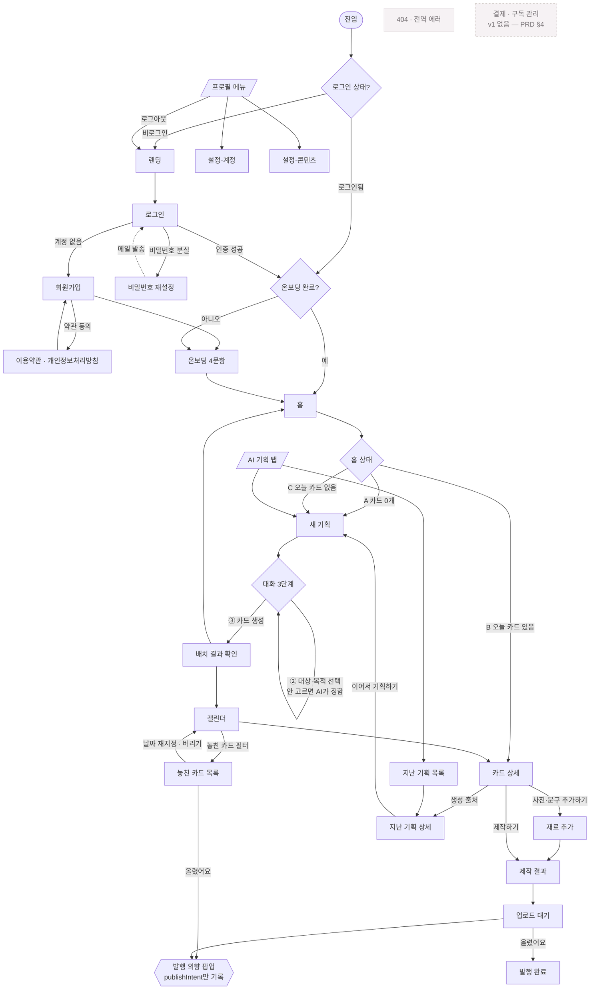

# PLAN.md — 차곡 (Chagok) 기술 설계

최종 수정: 2026-08-27

> **이 문서는 「무엇을 만들 것인가」의 기술 설계다.**
> 기획의 근거·의도는 `PRD.md`, 비주얼 규칙은 `DESIGN.md`에 있다. 여기로 옮겨 적지 않는다.
>
> 근거 표기 — `[PRD]` PRD에 명시됨 · `[IA]` `claude_14-IA-화면구조.md`에 명시됨 ·
> `[추가]` 두 문서에 없지만 동작에 필요해 넣음 · `TODO` 미확정

---

## 1. 서비스 기본

| | |
|---|---|
| **서비스 이름** | 차곡 (Chagok) |
| **한 줄 설명** | 말하면 정리되고, 정리되면 일정이 되고, 일정이 하나씩 콘텐츠로 완성된다 |

**타깃 · 핵심 문제 · 톤앤매너 · 유저 여정 — 자세한 내용은 `PRD.md` 참고.**

---

## 2. 핵심 객체

**3개로 나뉜다.** 저장 주기와 소유 관계가 달라 합칠 수 없다.

| 이름 | 무엇인가 | 왜 분리하나 |
|---|---|---|
| `user` | 계정 + 온보딩 4문항 설정 | 계정당 1개. 카드가 수백 장 쌓여도 이건 1건 |
| `plan` | 기획 세션 — 대화 1회로 확정된 기획안 | 카드 N장의 부모. 「지난 기획」(F10)·「이어서 기획」(F11)의 대상 |
| `card` | 콘텐츠 카드 — 실제 만들고 올리는 단위 | 상태가 4단계로 바뀌고 예정일을 가진다. 발행률의 분모 |

> **기록형 템플릿(F12)을 별도 객체로 만들지 않았다.**
> `[IA]` 2.1이 *"기록형은 여기서 템플릿을 1회 확정한다"*로 기획 대화 안에 두었고,
> 결과물도 「카드 N장」으로 같다. `plan.type`으로 구분한다.

> **구독·결제 객체가 없다.** `[PRD]` §4가 v1에서 결제를 제외했다.

### 2-1. `user`

```ts
/** 계정 + 온보딩에서 받은 콘텐츠 설정. Firestore 문서 ID = Firebase Auth uid */
type User = {
  uid: string;                    // Firebase Auth uid. 문서 ID와 동일
  email: string;                  // 로그인 이메일

  /** 온보딩 2문항 (F1 — 08-28 축소). 말투·피할 표현은 설정-콘텐츠에서 */
  field: string;                  // 활동 분야·주로 만드는 콘텐츠 (예: "홈트레이닝")
  uploadFrequency: number;        // 주당 업로드 목표 횟수. 캘린더 자동 배치(F4)의 간격 계산에 쓴다
  uploadDays?: number[];          // 업로드 요일 (0=월 … 6=일). 개수 = uploadFrequency (08-28 추가)
  visualPreferences?: {           // 온보딩 게시물 취향 (08-28) — «잘 모르겠어요»면 null
    selectedExamples: string[];   //   예시 6종(src/lib/style-examples.ts) 중 선택한 id들
    attributes: StyleAttributes[]; //  선택 예시의 시각 속성 — AI가 조합할 취향 재료 (특정 템플릿 반복이 아님)
    contentFormats: string[];     //   선택 예시의 콘텐츠 형식 (thought·editorial·routine·statement·diary·informational)
  } | null;
  tone: ToneKey | null;           // 말투 — 설정에서 선택. 정하기 전 null → 캡션은 기본 말투
  avoidExpressions: string[];     // 피할 표현. 캡션 생성 시 프롬프트의 금지 목록으로 들어간다

  brand: Brand | null;            // 「내 스타일」 — 카드뉴스 색·폰트 (08-31). 정하기 전엔 null
  onboardedAt: Timestamp | null;  // null이면 온보딩 미완료 → 라우트 가드가 /onboarding으로 보낸다
  createdAt: Timestamp;
};

/** 온보딩에서 예시 문장 2~3줄짜리 카드 4종으로 보여주고 고르게 한다 */
type ToneKey = 'friendly' | 'calm' | 'energetic' | 'professional';
// TODO: 4종의 실제 키·예시 문장 미확정. PRD §5-2에 «카드 4종»만 있고 내용은 없음
```

### 2-2. `plan`

```ts
/** 기획 세션. 대화 1회 = plan 1건 → card N장 */
type Plan = {
  id: string;                     // 자동 생성 ID
  userId: string;                 // 소유자 uid

  type: PlanType;                 // 'series' 일반 기획 | 'record' 기록형(F12)

  topic: string;                  // 주제. ① 단계에서 확정
  audiences: string[];            // 대상. ② 단계 멀티 선택 (라벨 후보 3개 + 기타 직접 입력)
  purposes: string[];             // 목적. 선택하지 않는다 — AI가 대상에 맞춰 정함, 기획안 카드에서 수정
  intent: string;                 // 기획의도. AI가 생성. 카드 상세에서만 노출(DESIGN.md §6)
  seriesTitle: string;            // 시리즈 제목. 놓친 카드 화면(3.1)에서 묶는 기준

  messages: PlanMessage[];        // 대화 히스토리 전문. 「지난 기획 상세」(2.4)에서 그대로 보여준다
  cardCount: number;              // 생성된 카드 수. 하한 1 · 상한 없음

  /** 기록형(type='record')일 때만 채워진다 */
  recordDays: number | null;      // 며칠치를 미리 깔지. TODO: PRD §9 미결 5 — 3개월이면 90장
  templateVarNames: string[];     // 템플릿 변수 이름 목록. 카드 상세에서 입력칸이 자동 렌더링된다

  photoUrls: string[];            // 기획 단계에서 올린 사진. 카드에 주소만 물려준다 (F13 · 08-31)
  stockPhoto: StockPick | null;   // 기획 단계에서 고른 추천 사진. 안 골랐으면 null (09-01)

  status: PlanStatus;             // 'draft' 대화 중 | 'confirmed' 확정되어 카드가 생성됨
  createdAt: Timestamp;           // TTV 측정 시작점 (PRD §5-3)
  confirmedAt: Timestamp | null;
};

type PlanType = 'series' | 'record';
type PlanStatus = 'draft' | 'confirmed';

type PlanMessage = {
  role: 'user' | 'assistant' | 'system';  // system = 상태 변경 기록(주제 변경 등). 말풍선이 아닌 가운데 라인
  text: string;
  createdAt: Timestamp;
};
```

### 2-3. `card`

```ts
/** 콘텐츠 카드 — 만들고 올리는 단위. 발행률의 분모가 된다 */
type Card = {
  id: string;                     // 자동 생성 ID
  userId: string;                 // 소유자 uid. 캘린더 조회의 기준
  planId: string;                 // 생성 출처. 카드 상세 → 「지난 기획 상세」(2.4)로 이동

  title: string;                  // 카드 주제 (전체 길이)
  shortTitle: string;             // 12자 내외. 캘린더 월간 칸이 좁아 원 제목은 6~9자에서 잘린다
  audience: string;               // 이 카드가 겨냥한 대상 1개 (plan.audiences 중 하나)
  intent: string;                 // 기획의도. 카드 상세에서만 노출

  scheduledDate: string;          // 예정일 'YYYY-MM-DD'. 캘린더 배치(F4)가 부여, 드래그로 변경
  status: CardStatus;             // 아래 상태 모델 참고
  publishIntent: PublishIntent;   // status와 별개 필드 (DESIGN.md §11)

  themeId: ThemeId;               // 산출물 테마. 카드 한 장 전체에 하나 (08-31)
  bgOverride?: string | null;     // 이 카드만의 배경색. 없으면 계정 스타일 (08-31)
  templateId: TemplateId | null;  // 구성 템플릿. null이면 AI가 구성까지 정한다 (08-31)
  visualType: VisualType;         // 이미지 폴백 사슬의 판정 결과 (DESIGN.md §12)
  photoUrls: string[];            // 사용자가 올린 사진. 순서 = 배열 순서 (F13)
  stockPhoto: StockPick | null;   // 기획에서 물려받은 추천 사진. 첫 이미지 자리에 쓴다 (09-01)
  extraNote: string;              // «이번에 꼭 넣을 내용» 자유 입력 (F13)
  templateVars: Record<string, string>; // 기록형의 그날 값. plan.templateVarNames와 짝을 이룬다

  caption: Caption | null;        // 캡션 생성(F7) 전에는 null
  slides: Slide[];                // 카드뉴스 5~8장 (F8). 생성 전에는 빈 배열

  createdAt: Timestamp;
  updatedAt: Timestamp;
  publishedAt: Timestamp | null;  // 「올렸어요」를 누른 시각. 발행률 집계의 근거
};

/**
 * 제작 대기 → 업로드 대기 → 발행 완료
 *     └──────────┴──────→ 버림 (어느 단계에서든)
 *
 * 「제작 완료(crafted)」는 없앴다 (08-31) — 제작이 끝나면 바로 업로드 대기.
 * 발행 의향의 '아니오'·'미응답' 구분은 publishIntent가 따로 든다.
 *
 * 「제작 중」은 없다. 렌더링이 0.05초라 로딩이지 상태가 아니다 (DESIGN.md §11).
 * overdue도 상태가 아니다 — scheduledDate < today && status != 'published' 로 계산한다.
 */
type CardStatus = 'planned' | 'pending' | 'published' | 'discarded';

/** status에 합치면 '아니오'와 '미응답'을 구분할 수 없어 분모가 흐려진다 — 별도 필드 유지 */
type PublishIntent = null | 'yes' | 'no';

type VisualType = 'user_photo_preferred' | 'stock_recommended' | 'text_only';


type Caption = {
  hook: string;                   // 첫 문장
  body: string;
  cta: string;
  hashtags: string[];             // 칩으로 표시 · 삭제·추가 가능
};

type Slide = {
  order: number;                  // 0부터. 순서 변경 시 이 값을 다시 매긴다
  layoutId: LayoutId;             // 레이아웃 6종 중 하나
  texts: Record<string, string>;  // 레이아웃의 텍스트 슬롯별 내용. 글자 «내용»만 수정 가능
  imageUrl: string | null;        // 'text-only'면 null
  styleOverrides?: Record<string, SlotStyle>; // 줄마다 글자 조절. 키는 슬롯 이름 (08-31)
  elements?: SlideElement[];      // 자유 배치. 있으면 레이아웃 대신 좌표로 그린다 (08-31)
  imageOrigin?: ImageOrigin;      // 이 사진이 어디서 왔는지 (08-31). 없으면 판단 불가 = 옛 슬라이드
};

/**
 * 카드뉴스 레이아웃 6종 `[확정 08-27]`
 *
 * 사용자가 6종 중 «고르는» 것만 가능하고 직접 만들 수는 없다 (DESIGN.md §12).
 * 각 레이아웃이 어떤 텍스트 슬롯을 갖는지는 시안이 나와야 확정된다 — 아래 TODO.
 */
type LayoutId =
  | 'cover'       // 표지 — 첫 장. 캡션의 hook을 크게 싣는다
  | 'text-only'   // 글자만. 이미지 폴백 3순위의 착지점 (DESIGN.md §12)
  | 'image-top'   // 위 이미지 + 아래 글
  | 'image-full'  // 전면 이미지 + 오버레이 글
  | 'list'        // 번호 목록 — «3가지 이유» 같은 구조
  | 'closing';    // 마무리 — 캡션의 cta·팔로우 유도

// TODO: 각 레이아웃의 texts 슬롯 키와 여백·글자 크기·이미지 비율은 시안이 나와야 정해진다.
//       DESIGN.md §18 참조. 이름이 확정됐으므로 렌더러 골격은 먼저 짤 수 있다.

/**
 * 산출물 테마 3종 `[확정 08-31]`
 *
 * 레이아웃이 «무엇을 어디에 놓는가»면 테마는 «어떤 색·글자 비율로 그리는가»다.
 * 레이아웃과 같이 **고르는 것만 가능하고 직접 만들 수 없다** — 색을 직접
 * 지정하게 하면 DESIGN.md §0의 «디자인 편집기 아님»을 어긴다.
 *
 * 이름은 08-28에 확정한 visual direction 3종을 그대로 쓴다 (아래 변경 이력).
 * 온보딩 취향(`users.visualPreferences`)의 Direction과 **같은 id**여야
 * 취향과 산출물이 어긋나지 않는다.
 *
 * 산출물 색은 브랜드 토큰을 따르지 않는다 — 08-28 확정 예외.
 * 실제 값은 `lib/render/themes.ts`.
 */
type ThemeId =
  | 'warm'        // 포근한 — 베이지 바탕 · 넉넉한 여백
  | 'editorial'   // 또렷한 — 흰 바탕 · 크고 굵은 제목
  | 'graphic';    // 글자 중심 — 글씨를 크게, 가운데로

/**
 * 구성 템플릿 4종 `[확정 08-31]`
 *
 * 레이아웃이 «한 장 안에 무엇을 어디에», 테마가 «어떤 색·글자 비율로»라면
 * 템플릿은 **«몇 장을, 어떤 순서로, 각 장이 무슨 일을 하는가»**다.
 *
 * **더미 문구를 담지 않는다.** 캔바식 «껍데기를 주고 채우게 하기»는
 * DESIGN.md §0의 «사용자가 빈칸부터 채우게 만든다» 금지에 걸린다.
 * 틀과 각 장의 «할 일»만 담고 문구는 AI가 쓴다.
 *
 * **고르는 자리는 제작 «결과» 화면이다.** 기획 전에 갤러리를 두면
 * «AI가 먼저 구조화 → 사용자가 확인·수정»(DESIGN.md §7)이 뒤집힌다.
 *
 * id는 `lib/style-examples.ts`의 ContentFormat과 같은 말을 쓴다 —
 * 온보딩이 이미 형식 취향(`visualPreferences.contentFormats`)을 모으고 있다.
 * 4종만 둔 이유는 08-28 취향 예시 재작업에서 살아남은 형식이기 때문.
 * collage(사진 여러 장)·review(별점)는 레이아웃 6종으로 못 그린다.
 *
 * 실제 구성은 `lib/card-templates.ts`.
 */
type TemplateId =
  | 'informational' // 정보 카드뉴스 — 5장. 결론 먼저 · 근거 목록 · 저장 유도
  | 'diary'         // 기록 — 5장. 사진 중심
  | 'statement'     // 한 문장 — 5장. 큰 한 마디
  | 'editorial';    // 에세이 — 6장. 사진과 글을 번갈아
```

---

## 3. 기능 정의

> **이용 범위** — `[PRD]` §4·§5-3·§5-5가 *"v1은 전체 무료. 유료 구분 없음"*으로 확정했다.
> 그래서 사용자 기능은 전부 **「전체 무료(v1)」**이고, 유료 전용은 하나도 없다.
> v2에 과금이 붙으면 이 열을 다시 채운다 (`PRD.md` §10-6).

| 기능 | 설명 | 관련 화면 | 관련 핵심 객체 | MVP 범위 | 이용 범위 | 예외/실패 시 처리 |
|---|---|---|---|---|---|---|
| **회원가입** `[추가]` | 이메일·비밀번호로 계정 생성 · 약관 동의 | 회원가입 | `user` | 포함 | 전체 무료 | 이메일 중복·형식 오류 → 입력 아래 인라인 안내. **비밀번호 8~20자, 조합 자유** |
| **로그인** `[추가]` | 이메일·비밀번호 · **Google 로그인(09-01)** · 자동 로그인 유지 | 로그인 | `user` | 포함 | 전체 무료 | 인증 실패 → 인라인 안내. **비로그인 사용 불가** (PRD §5-4). Google 첫 로그인은 users 문서 생성 후 온보딩으로 |
| **비밀번호 재설정** `[IA]` | 재설정 메일 발송 | 비밀번호 재설정 | `user` | 포함 | 전체 무료 | 미가입 이메일이어도 «메일을 보냈어요»로 동일 응답 (계정 존재 여부 노출 방지) |
| **로그아웃** `[IA]` | 세션 종료 | 없음-전역 메뉴 | `user` | 포함 | 전체 무료 | — |
| **온보딩 2문항 (F1)** `[08-28 축소]` | 활동 분야 · 업로드 빈도. 60초 — 말투·피할 표현은 설정-콘텐츠로 이동 | 온보딩 | `user` | 포함 | 전체 무료 | 미완료 상태로 이탈 → 다음 로그인 시 다시 온보딩으로 |
| **온보딩 가드** `[추가]` | `onboardedAt`이 null이면 다른 화면 접근 차단 | 없음-백엔드 로직 | `user` | 포함 | 없음(백엔드) | — |
| **AI 기획 대화 (F2)** | 3단계 — ①주제 확인(필요시, 후보 4개·열린 질문 금지) → ②대상·목적 선택 → ③카드 생성 | 새 기획 | `plan` | 포함 | 전체 무료 | 5초 초과 → 대기 문구 유지. 실패 시 **자동 1회 재시도** → 말풍선 자리에 인라인 + `[다시 보내기]`. 이전 대화는 계속 읽을 수 있다. **새로고침·뒤로가기로 이탈 후 재진입 → 최근 draft 감지 시 「하던 기획이 있어요」 팝업으로 복원** (08-28) |
| **시리즈 분해 · 카드 생성 (F3)** | 주제 × 대상 → 카드 N장 = 대상 수 × 주제 수 (하한 1 · **1회 생성 상한 8** — `MAX_CARDS_PER_RUN`, 08-28) | 새 기획 | `plan` `card` | 포함 | 전체 무료 | **원자성 — 전부 성공하거나 전부 취소.** 일부 실패 시 이미 만든 카드를 되돌리고 캘린더에 아무것도 남기지 않는다 |
| **short_title 생성** `[DESIGN.md §8]` | 캘린더 칸용 12자 내외 제목을 카드 생성 시 함께 생성 | 없음-백엔드 로직 | `card` | 포함 | 없음(백엔드) | 12자 초과 시 잘라 쓰되 원 제목은 보존 |
| **캘린더 자동 배치 (F4)** | `user.uploadFrequency`에 맞춰 예정일 부여 | 배치 결과 확인 · 캘린더 | `card` `user` | 포함 | 전체 무료 | 같은 날 몰림 방지. **TODO: 배치 규칙(요일 선호·최소 간격) 미확정** |
| **오늘의 카드 (F5)** | 오늘 예정 카드 **1건만** 노출 | 홈 | `card` | 포함 | 전체 무료 | 오늘 카드 없음 → 홈 상태 C. 카드 0개 → 홈 상태 A (DESIGN.md §9) |
| **카드 상세 · 생성 출처 (F6)** | 기획 정보 확인·수정 · 원 기획 세션으로 이동 | 카드 상세 | `card` `plan` | 포함 | 전체 무료 | 원 `plan` 삭제됨 → 출처 링크 숨김 |
| **캡션 생성 (F7)** | Hook · Body · CTA · Hashtag | 제작 결과 | `card` | 포함 | 전체 무료 | 생성 실패 → 해당 영역 인라인 표시 + 다시 만들기 |
| **템플릿형 카드뉴스 (F8)** | 슬라이드 5~8장 · 레이아웃 6종 · 이미지 폴백 사슬 | 제작 결과 | `card` | 포함 | 전체 무료 | 사진 없으면 스톡 → 없으면 text_only. **어디서 멈춰도 완성된다** |
| **발행 상태 관리 (F9)** | 발행 의향 1문항 → 업로드 대기 → 발행 완료 | 발행 상태 관리(팝업) | `card` | 포함 | 전체 무료 | 「올렸어요」를 안 누르면 미발행으로 집계 → F14가 회수 |
| **확정 기획 세션 조회 (F10)** | 지난 기획 목록·상세 · 대화 히스토리 전문 | 지난 기획 목록 · 지난 기획 상세 | `plan` | 포함 | 전체 무료 | 0건 → empty state |
| **이어서 기획하기 (F11)** | 지난 기획을 이어받아 새 대화 시작 | 지난 기획 상세 | `plan` | 포함 *(Should)* | 전체 무료 | **TODO: 중복 방지 — 과거 카드를 프롬프트에 몇 개까지 넣을지 미확정 (PRD §9 미결 4)** |
| **기록형 카드 (F12)** | 템플릿 1회 확정 → 기간만큼 매일 자동 생성 | 새 기획 | `plan` `card` | 포함 | 전체 무료 | **TODO: 몇 개월치까지 미리 깔지 미확정 (PRD §9 미결 5)** |
| **기획안 업데이트 (F13)** | 사진 여러 장 · 템플릿 변수 · 이번에 꼭 넣을 내용 | 재료 추가 | `card` | 포함 | 전체 무료 | 사진 업로드 실패 → 해당 사진만 인라인 표시, 나머지는 유지 |
| **놓친 카드 모아보기 (F14)** | 예정일 지났는데 미발행인 카드를 시리즈별로 | 놓친 카드 목록 | `card` | 포함 | 전체 무료 | 0건 → **죄책감 아닌 문구로** empty state (빨간색·경고 금지) |
| **overdue 계산** `[DESIGN.md §11]` | `scheduledDate < today && status != 'published'` | 없음-백엔드 로직 | `card` | 포함 | 없음(백엔드) | 별도 status를 만들지 않는다 |
| **예정일 변경** `[IA]` | 캘린더 드래그 · 놓친 카드 재지정 · 카드 상세 수정 | 캘린더 · 놓친 카드 목록 · 카드 상세 | `card` | 포함 | 전체 무료 | 저장 실패 → 원위치 + Toast |
| **카드 버리기** `[IA]` | status를 'discarded'로. **삭제가 아니다** | 카드 상세 · 놓친 카드 목록 | `card` | 포함 | 전체 무료 | 되돌릴 수 없으므로 확인 모달 |
| **콘텐츠 설정 수정** `[IA]` | 온보딩 4문항 값 변경 · 이후 생성물부터 반영 | 설정-콘텐츠 | `user` | 포함 | 전체 무료 | 저장 실패 → 인라인 표시 |
| **회원 탈퇴** `[IA]` | 계정 + 데이터 삭제 | 설정-계정 | `user` `plan` `card` | 포함 | 전체 무료 | **TODO: 삭제 범위·보관 기간 미확정 (§10)** |
| **랜딩** `[PRD §5-1]` | 제품 소개 · 테스트 참가자 컨텍스트 전달 | 랜딩 | 없음 | 포함 | 전체 무료 | 정적 페이지 |
| **AI 생성물 표시** `[법정 의무 · 09-02]` | AI 기본법 제31조 3종 — ①사전 고지 ②이미지 **비가시 표시**(XMP · IPTC `DigitalSourceType`) ③**다운로드 단계 안내**. 캡션은 텍스트라 메타데이터를 못 실어 화면에 표시 | 랜딩 · 제작 결과 · 이용약관 | `card` | 포함 | 전체 무료 | **표시가 빠지면 그 자체로 위반이다** (과태료 3천만원 이하). 시행령이 ②를 비가시로만 할 때 ③을 조건으로 달아서, **②와 ③은 한 쌍이다 — 하나만 지우면 다른 하나도 무효가 된다.** 문구는 `lib/ai-disclosure.ts` 한 곳에서 관리 |
| ~~자동·예약 발행~~ | | | | **제외** | — | `[PRD]` §4 — 검증 질문을 흐린다 |
| ~~인스타 계정 연동~~ | | | | **제외** | — | `[PRD]` §4 — 따라서 성과 분석도 불가 |
| ~~이미지 보정·합성·편집기~~ | | | | **제외** | — | `[PRD]` §4 — Canva 영역 |
| ~~AI 이미지 생성~~ | | | | **제외** | — | `[PRD]` §4 — v2 |
| ~~결제·요금제~~ | | | | **제외** | — | `[PRD]` §4 — v1 전체 무료 |
| ~~알림·리마인더~~ | | | | **제외** | — | `[IA]` v1 제외 |

---

## 3-1. 기능 상세 명세

> MVP 범위가 「제외」인 것은 뺐다.

| 기능명 | 트리거 | 입력값 | 처리 로직 | 출력/결과 | 예외 처리 |
|---|---|---|---|---|---|
| 회원가입 | `[가입하기]` 클릭 | 이메일 · 비밀번호 · 약관 동의 여부 | Firebase Auth 계정 생성 → `user` 문서 생성(`onboardedAt: null`) | 온보딩 화면으로 자동 이동 | 중복 이메일·약한 비밀번호 → 해당 입력 아래 인라인 |
| 로그인 | `[로그인]` 클릭 · 앱 재진입 | 이메일 · 비밀번호 | Firebase Auth 인증 → 세션 유지(자동 로그인) | `onboardedAt`이 null이면 온보딩, 아니면 홈 | 인증 실패 → 인라인. 재시도 횟수 제한 없음. **미가입 이메일은 «가입되지 않은 이메일» 구분 안내 (08-28 — 콘솔에서 이메일 열거 보호 해제 필요)** |
| 비밀번호 재설정 | `[비밀번호를 잊으셨나요]` | 이메일 | Firebase Auth 재설정 메일 발송 | «메일을 보냈어요» 안내 | 미가입 이메일도 **같은 문구**로 응답 |
| 로그아웃 | 프로필 메뉴 → `[로그아웃]` · **설정-계정 `[로그아웃]`** | 없음 | 세션 종료 | 랜딩으로 이동 | — |
| 온보딩 2단계 (F1) | 가입 직후 · 미완료 상태 로그인 | ①콘텐츠 방향(서술형 200자) · 빈도 = 주기(1~7)+요일(주기 개수만큼, 매일=UI 없이 전체 자동) ②게시물 취향 — 같은 주제 예시 6종 캐러셀에서 복수 선택(1~3개 권장·강제 없음), «잘 모르겠어요»로 건너뛰기 가능 | `user` 문서에 저장 → `onboardedAt` 기록 (서버 PATCH `/api/users/me`, 취향 속성은 서버가 id로 매핑) | **첫 AI 기획 대화(/plan/new)로 직행** | 중간 이탈 시 저장 안 함 → 다음 진입에 처음부터 |
| 온보딩 가드 | 보호된 화면 진입 | 없음 (세션의 uid) | `user.onboardedAt`을 확인 | null이면 온보딩으로 리다이렉트 | `user` 문서 없음 → 로그아웃 처리 |
| AI 기획 대화 (F2) | 「아이디어 말하기」 · 새 기획 진입 | 자유 텍스트 · ②단계 대상·목적 선택 · 기획안 카드 부분 수정 | 서버 API로 AI 호출 → `plan`(status:'draft')에 `messages` 누적. ①은 주제가 전혀 없을 때만 — 후보 4개 제시(열린 질문 금지). ②에서 고르지 않으면 **AI가 알아서 정하고 넘어간다** | 대화 말풍선 · 기획안 패널 실시간 갱신 | 5초 초과 → 대기 문구 유지. 실패 시 자동 1회 재시도 → 인라인 + `[다시 보내기]` |
| 시리즈 분해 · 카드 생성 (F3) | ③단계 진입 | `plan.topic` · `audiences` · `purposes` | 주제 × 대상 조합 → `card` N장 생성, `plan.status='confirmed'` `cardCount` 기록 | 배치 결과 화면으로 이동 | **원자성** — 일부 실패 시 생성분을 전부 되돌린다. `plan.status`도 'draft'로 유지 |
| short_title 생성 | 카드 생성과 동시 | `card.title` | AI가 12자 내외 축약본 생성 | `card.shortTitle` 저장 | 초과 시 잘라 쓰되 `title`은 보존 |
| 캘린더 자동 배치 (F4) | 카드 생성 직후 | `user.uploadFrequency` · 카드 수 | 빈도에 맞춰 `scheduledDate` 부여 | 「N개의 콘텐츠가 일정에 추가됐어요」 + 날짜 목록 | **TODO: 배치 규칙(요일 선호·최소 간격) 미확정** |
| 오늘의 카드 (F5) | 홈 진입 | 없음 (uid · 오늘 날짜) | `scheduledDate == today && status != 'discarded'` 조회 → **1건만** | 상태 B: Featured Card + `[제작하기]` | 0건 → 상태 C. 전체 0개 → 상태 A |
| 카드 상세 · 생성 출처 (F6) | 홈·캘린더에서 카드 클릭 | `cardId` | `card` 조회 + `planId`로 출처 링크 | 기획 정보 + `[제작하기]` `[사진·문구 추가하기]` | 카드 없음 → 404. 원 `plan` 없음 → 출처 숨김 |
| 캡션 생성 (F7) | `[제작하기]` 클릭 | `card` 기획 정보 · `user.tone` · `avoidExpressions` | 서버 API로 AI 호출 → `Caption` 생성 | Hook·Body·CTA·해시태그 칩 | 자동 1회 재시도 → 해당 영역 인라인 + `[다시 만들기]`(보조 버튼). **글자 직접 수정이 기본 경로** |
| 템플릿형 카드뉴스 (F8) | `[제작하기]` 클릭 (캡션과 함께) | `card` 정보 · `photoUrls` · `extraNote` · `templateVars` | 이미지 폴백 사슬로 `visualType` 판정 → 렌더링 요청 → `slides` 저장, `status='pending'` | skeleton 3장 → 순차 reveal | 사진 없으면 스톡 → 없으면 text_only. **어디서 멈춰도 완성** |
| 발행 상태 관리 (F9) | 제작 후 · 홈 `[업로드하셨나요?]` | 의향 1문항 응답 | 「업로드할게요」 → `publishIntent='yes'` / 「고민 중」 → `publishIntent='no'` (status는 pending 유지). 「올렸어요」 → `status='published'`, `publishedAt` 기록 | 상태 배지 갱신 | 저장 실패 → Toast + 원상 복구 |
| 확정 기획 세션 조회 (F10) | AI 기획 탭 → `[지난 기획]` | 없음 (uid) | `plan` where `status='confirmed'` 최신순 | 주제·확정일·카드 수·진행 상태 목록 | 0건 → empty state |
| 이어서 기획하기 (F11) | 지난 기획 상세 → `[이어서 기획하기]` | `planId` | 기존 `messages`를 컨텍스트로 새 대화 시작 | 새 기획 화면(이전 맥락 로드됨) | **TODO: 과거 카드 몇 개까지 프롬프트에 넣을지 미확정** |
| 기록형 카드 (F12) | 대화에서 기록형으로 판정 | 템플릿 예시 핑퐁 · 기간 | `plan.type='record'` · `templateVarNames` 확정 → 기간만큼 매일 `card` 생성 | 배치 결과 화면 | **TODO: 최대 기간 미확정. 3개월이면 90장** |
| 기획안 업데이트 (F13) | 카드 상세 → `[사진·문구 추가하기]` | 사진 파일 여러 장 · 자유 텍스트 · 템플릿 변수 값 | Storage 업로드 → `photoUrls` · `extraNote` · `templateVars` 저장 | `[제작하기]`로 진행 | 개별 사진 실패 → 그 사진만 인라인 표시, 나머지 유지 |
| 놓친 카드 모아보기 (F14) | 캘린더 → 놓친 카드 필터 | 없음 (uid · 오늘 날짜) | overdue 조건으로 조회 → `plan.seriesTitle`로 묶기 | 시리즈별 목록 + 올렸어요·날짜 재지정·버리기 | 0건 → 죄책감 없는 문구 (빨간색·경고 금지) |
| overdue 계산 | 캘린더·놓친 카드 렌더링 시 | `scheduledDate` · `status` · 오늘 날짜 | `scheduledDate < today && status != 'published'` | UI에 표시만 | 별도 status를 만들지 않는다 |
| 예정일 변경 | 드래그 · 날짜 재지정 · 상세 수정 | 새 날짜 | `card.scheduledDate` 갱신 | 캘린더 즉시 반영 + Toast | 실패 → 원위치 + Toast |
| 카드 버리기 | `[버리기]` 클릭 | `cardId` | `status='discarded'`. **문서를 지우지 않는다** | 목록에서 제외, 발행률 분모에는 남음 | 되돌릴 수 없으므로 확인 모달 |
| 콘텐츠 설정 수정 | 설정-콘텐츠에서 저장 | 온보딩 4문항과 동일 | `user` 문서 갱신 | Toast «저장됐어요» · **이후 생성물부터 반영** | 저장 실패 → 인라인 |
| 회원 탈퇴 | 설정-계정 → `[회원 탈퇴]` | 확인 입력 | Auth 계정 삭제 + 데이터 삭제 | 랜딩으로 이동 | **TODO: 삭제 범위·유예 기간 미확정** |
| 랜딩 | URL 직접 진입 · 비로그인 상태로 `/` | 없음 | 정적 렌더링 | 제품 소개 + `[시작하기]` | — |

---

## 4. 화면 목록

**총 19개.** 1단계(기능 표에서 수집) 15개 + 2단계(기본 확인 목록) 3개 + 3단계(구조적 특성) 1개.

| 화면 이름 | 라우트(제안) | 목적 | 로그인 필요 | 추가 근거 |
|---|---|---|---|---|
| 랜딩 | `/` *(비로그인 시)* | 제품 소개 · 테스트 참가자 컨텍스트 전달 | ✕ | |
| 로그인 | `/login` | 이메일·비밀번호 인증 | ✕ | |
| 회원가입 | `/signup` | 약관 동의 + 계정 생성 | ✕ | |
| **비밀번호 재설정** | `/login/reset` | 재설정 메일 발송 | ✕ | **3단계에서 추가** — 이메일·비밀번호 로그인이면 비밀번호를 잊은 사용자가 반드시 생긴다. 이게 없으면 계정이 영구 잠긴다 |
| 온보딩 | `/onboarding` | 2단계(방향·빈도 → 게시물 취향 수집) · 60초 | ○ | |
| 홈 | `/` *(로그인 시)* | 오늘 할 것 하나만 보여준다 | ○ | |
| 새 기획 | `/plan/new` | AI 기획 대화 3단계 | ○ | |
| 배치 결과 확인 | `/plan/[planId]/result` | 생성된 카드 + 배정된 날짜 확인 | ○ | |
| 지난 기획 목록 | `/plan/history` | 확정된 기획 세션 목록 | ○ | |
| 지난 기획 상세 | `/plan/[planId]` | 대화 히스토리 · 이어서 기획하기 | ○ | |
| 캘린더 | `/calendar` | 월간 뷰 · 드래그 · 상태별 색 | ○ | |
| 놓친 카드 목록 | `/calendar/missed` | 시리즈별 묶음 · 재지정 · 버리기 | ○ | |
| 카드 상세 | `/card/[cardId]` | 기획 정보 + 제작 진입 | ○ | |
| 재료 추가 | `/card/[cardId]/materials` | 사진 · 템플릿 변수 · 꼭 넣을 내용 | ○ | |
| 제작 결과 | `/card/[cardId]/result` | 슬라이드 · 레이아웃 · 캡션 수정 | ○ | |
| 설정-계정 | `/settings/account` | 이메일·비밀번호 변경 · 회원 탈퇴 | ○ | |
| 설정-콘텐츠 | `/settings/content` | 온보딩 4문항 값 수정 | ○ | |
| **이용약관 · 개인정보처리방침** | `/terms` · `/privacy` | 가입 시 동의 대상 · 개인정보 수집 고지 | ✕ | **2단계에서 추가** — `[IA]` 0.2가 «약관 동의»를 요구하는데 약관 문서가 어디에도 없다. 이메일·사진을 수집하므로 처리방침도 필요 |
| **404 / 전역 에러** | `not-found` · `error` | 없는 주소 · 알 수 없는 오류 | ✕ | **2단계에서 추가** |

> **발행 상태 관리(4.3)는 화면이 아니라 팝업이다.** `[IA]`가 팝업으로 명시했고
> `DESIGN.md` §13이 모바일에서 bottom sheet를 우선하라고 한다. 라우트를 주지 않는다.

### 기본 확인 목록 대조 결과

| 항목 | 판정 |
|---|---|
| 결제 실패/성공 결과 화면 | **불필요** — `[PRD]` §4가 v1에서 결제를 제외했다. 결제가 없으므로 결과 화면도 없다 |
| 이용약관 / 개인정보처리방침 | **추가함** — 정기결제는 없지만, 가입 시 약관 동의를 받고 이메일·사진을 수집한다 |
| 404 / 접근 권한 없음 | **404만 추가.** 모든 데이터가 본인 소유라 «권한 없음»이 따로 없다. 남의 카드 주소로 들어오면 조회 결과가 없어 404가 된다 |
| 전역 에러 화면 | **추가함** |

### 구조적 특성에서 도출한 화면

이 서비스의 특성을 먼저 짚었다.

```
① 이메일·비밀번호 로그인이고 소셜 로그인이 없다   → 비밀번호 분실 경로가 반드시 필요
② AI가 결과물을 만들고 과거 것을 다시 본다       → 「지난 기획」이 이미 있다 (F10·2.3·2.4)
③ 자동 발행이 없어 사용자가 직접 눌러야 한다      → 「놓친 카드」가 이미 있다 (F14·3.1)
④ 결제가 없다                                → 구독 관리·결제수단 화면 불필요
⑤ 캘린더가 있고 날짜를 옮긴다                   → 별도 화면 없이 드래그로 처리 (IA 확정)
```

**②③⑤는 이미 IA에 있어 추가하지 않았다.** ④는 해당 없음.
**추가한 것은 ① 하나 — 비밀번호 재설정.**

---

## 5. 화면 흐름



**결제 분기가 없다.** `[PRD]` §4가 v1에서 결제를 제외했으므로 «체험 중 카드 선등록 vs 체험 종료 후 결제» 갈림길 자체가 존재하지 않는다. TODO로도 남기지 않는다 — v2 이슈다 (`PRD.md` §10-6).

### PRD와 다르게 판단한 지점

| | 지점 | PRD·IA | 이 문서의 판단 | 이유 |
|---|---|---|---|---|
| 1 | **랜딩 라우트** | 명시 없음 | `/` 를 **비로그인=랜딩 / 로그인=홈**으로 분기 | 랜딩이 유입 채널이 아니라 소개 자산(PRD §5-1)이라 별도 주소를 팔 이유가 없다. 홈도 `/`가 자연스럽다 |
| 2 | **비밀번호 재설정을 화면으로 승격** | `[IA]` 0.1 안에 한 줄 언급 | 독립 화면 `/login/reset` | 별도 입력·별도 결과 안내가 필요해 로그인 폼 안에서 처리하기 어렵다 |
| 3 | **약관·처리방침 화면 신설** | `[IA]` 0.2가 «약관 동의»만 언급 | `/terms` `/privacy` 추가 | 동의를 받으려면 동의 대상 문서가 있어야 한다 |
| 4 | **이용 범위를 「전체 무료」로 통일** | 템플릿은 «무료+유료 공통 / 유료 전용» | 유료 열을 만들지 않음 | PRD §4·§5-3·§5-5가 v1 전체 무료로 확정. 유료 열을 비워두면 있는 것처럼 읽힌다 |
| 5 | **기록형을 별도 객체로 두지 않음** | `[IA]` F12를 독립 기능으로 기술 | `plan.type='record'`로 흡수 | 확정 장소(2.1)와 결과물(카드 N장)이 일반 기획과 같다 |
| 6 | **`card`를 최상위 컬렉션으로** | 명시 없음 | `users/{uid}` 하위가 아닌 최상위 | 캘린더가 «기간 + 상태»로 조회한다. 서브컬렉션이면 복합 인덱스 구성이 불리하다 (§7) |

> ⚠️ **7. IA와 PRD가 충돌한다 — 임의로 정하지 않았다.**
> `[IA]` 5.1 계정 화면에 **«요금제(무료 · 월 9,900원)»**가 있는데,
> `[PRD]` §4는 **«결제·요금제 v1 제외»**를 `[확정]`으로 못 박았다.
> IA 자신도 *"결제 연동 v1 포함 여부 미정"*이라 적어 두었다.
> **PRD가 `[확정]`이므로 v1 설정-계정에서 요금제 항목을 빼고 설계했다.** 확인 바란다.

---

## 6. API 라우트 목록

> **AI 호출은 전부 서버에서만 한다.** 클라이언트에서 직접 호출하지 않는다 —
> API 키가 브라우저로 새어 나가고, `avoidExpressions` 같은 제약을 우회할 수 있게 된다.

| 메서드 | 경로 | 설명 | 관련 기능 / 핵심 객체 | 인증 필요 |
|---|---|---|---|---|
| POST | `/api/plans` | 기획 세션 생성 (draft) | F2 · `plan` | ○ |
| POST | `/api/plans/[planId]/messages` | 대화 1턴 — **AI 호출** | F2 · `plan` | ○ |
| POST | `/api/plans/[planId]/confirm` | 기획 확정 → **카드 N장 생성 + short_title 생성 (AI)** | F3 · `plan` `card` | ○ |
| POST | `/api/plans/[planId]/schedule` | 업로드 빈도에 맞춰 예정일 배정 | F4 · `card` `user` | ○ |
| POST | `/api/plans/[planId]/continue` | 이전 맥락을 이어 새 대화 시작 | F11 · `plan` | ○ |
| POST | `/api/cards/[cardId]/caption` | 캡션 생성 — **AI 호출** | F7 · `card` `user` | ○ |
| POST | `/api/cards/[cardId]/render` | 카드뉴스 **구성 생성** — 슬라이드 레이아웃·텍스트를 만들어 저장, status→'pending'. 완성 PNG는 저장하지 않는다 | F8 · `card` | ○ |
| GET | `/api/cards/[cardId]/slides/[order]/image` | 슬라이드 1장을 **요청 시 PNG로 렌더링** — satori + sharp (같은 프로세스 안) | F8 · `card` | ○ |
| PATCH | `/api/cards/[cardId]/content` | 제작 결과 **부분 수정** — 캡션 전체 · 슬라이드 texts만. layoutId·imageUrl·order는 서버가 기존 값 유지(편집 범위 강제, DESIGN.md §12) | F7 F8 수정 · `card` | ○ |
| PATCH | `/api/cards/[cardId]` | 기획 정보·예정일 수정 | F6 · 예정일 변경 · `card` | ○ |
| PATCH | `/api/cards/[cardId]/status` | 발행 의향·발행 완료·버리기 | F9 · 카드 버리기 · `card` | ○ |
| POST | `/api/plans/[planId]/photos` | **기획 단계** 사진 업로드 URL 발급 (08-31). 확정된 기획은 409 | F2 · `plan` | ○ |
| POST | `/api/cards/[cardId]/photos` | 사진 업로드 URL 발급 | F13 · `card` | ○ |
| PATCH | `/api/users/me` | 온보딩 저장 · 콘텐츠 설정 수정 | F1 · 설정 · `user` | ○ |
| DELETE | `/api/users/me` | 회원 탈퇴 — 계정 + 데이터 삭제 | 회원 탈퇴 · `user` `plan` `card` | ○ |

**조회(GET)는 API route를 만들지 않는다.** 홈·캘린더·목록은 Firestore 보안 규칙으로 본인 문서만 읽게 하고 클라이언트 SDK로 직접 읽는다. 라운드트립이 한 번 줄고, 규칙이 이미 같은 보호를 한다.
**예외는 슬라이드 이미지 GET 하나** — Firestore 조회가 아니라 서버 렌더링이라 route가 필요하다.

> `[PRD §6 확정]` **외부 렌더링 서비스를 호출하지 않는다.** satori+sharp가 같은 Node 프로세스에서
> 돌기 때문에 이 route가 곧 렌더러다. 네트워크 왕복이 없어 실패 지점이 하나 줄어든다.

> **완성 PNG는 어디에도 저장하지 않는다 (08-27 확정).** `Slide` 스키마(§2-3)에는 렌더링 결과
> 필드가 없다 — 카드에는 구성(layoutId·texts)만 저장하고, 이미지는 요청 시 즉석 렌더링한다
> (장당 5~10ms 실측, `scripts/render-smoke.ts`). Storage 버킷·Blaze 업그레이드 없이 동작하므로
> 무예산 전제(PRD §6)와 맞는다. 사용자 업로드 사진(F13)은 별개 — Storage가 필요하며 §8 TODO 유지.

---

## 7. 데이터 구조 (Firestore)

| 컬렉션 | 문서 ID 규칙 | 서브컬렉션 | 보안 규칙 메모 |
|---|---|---|---|
| `users` | **Firebase Auth uid** | 없음 | 본인(`uid == request.auth.uid`)만 읽기·쓰기. `onboardedAt`은 **서버만 쓰기** (08-27 확정 — 온보딩 저장이 어차피 `PATCH /api/users/me`를 거친다) |
| `plans` | 자동 생성 ID | `messages` *(대화가 길어지면 분리)* | `userId == request.auth.uid`인 문서만. `status`·`cardCount`는 **서버만 쓰기** |
| `cards` | 자동 생성 ID | 없음 | `userId == request.auth.uid`인 문서만. `slides`·`caption`은 **서버만 쓰기**(AI 생성물). `status`·`publishIntent`·`scheduledDate`는 클라이언트 쓰기 허용 |

**`cards`를 `users` 하위 서브컬렉션으로 두지 않았다.** 캘린더가 «uid + 기간 + 상태»로 조회하는데, 서브컬렉션이면 컬렉션 그룹 쿼리가 필요해 인덱스 구성이 불리하다.

**`plan.messages`는 일단 문서 안 배열로 둔다.** 대화가 길어져 문서 1MB 한도에 가까워지면 서브컬렉션으로 옮긴다. TODO: 턴 수 상한 미확정.

### Cloud Storage (사용자 사진, F13)

| 경로 | 담기는 것 | 보안 규칙 메모 |
|---|---|---|
| `plans/{planId}/photos/{uuid}.{jpg\|png\|webp}` | **기획 단계**에서 올린 사진 (08-31). 카드 생성 시 **주소만** 물려준다 — 대상이 여럿이면 카드도 여럿이지만 파일은 한 벌 | `storage.rules` — `plans/{planId}.userId` 조회로 본인 기획만. delete 금지(카드가 참조 중) |
| `cards/{cardId}/photos/{uuid}.{jpg\|png\|webp}` | 재료 추가에서 올린 사진. 순서는 `card.photoUrls` 배열 순서를 따른다 | `storage.rules` — Firestore의 `cards/{cardId}.userId`를 조회해 **본인 카드만** 읽기·쓰기. 형식 3종·10MB 제한. delete 금지 |

**파일명은 사용자가 준 이름을 쓰지 않는다.** 원본 이름에는 경로 문자나 개인정보가 섞일 수 있고, 같은 이름을 다시 올리면 앞의 것을 덮어쓴다. 서버가 UUID로 새로 짓는다.

**업로드는 서명 URL 방식이다.** 서버(`POST /api/cards/[cardId]/photos`)가 소유권·형식·장수를 검사하고 10분짜리 서명 URL만 발급하며, 파일 본체는 브라우저 → Storage로 직접 간다. 앱 서버가 사진 용량만큼의 메모리·시간을 쓰지 않게 하려는 구조다. 서명 URL은 Admin 권한이라 `storage.rules`를 우회하므로, **쓰기 방어는 API 라우트가, 읽기 방어는 규칙이 맡는다.**

`photoUrls`에 저장하는 값은 **다운로드 토큰이 붙은 영구 URL**이다. 서명된 읽기 URL은 최대 7일이라 저장할 수 없어, 업로드 시점에 토큰을 함께 심는다.

> **브라우저에서 직접 PUT 하려면 버킷 CORS 설정이 필요하다** (`storage.cors.json`). 빠뜨리면 업로드가 CORS 오류로 조용히 실패한다. 배포 도메인이 생기면 `origin`에 추가해야 한다.

### 필요한 인덱스

```
cards  (userId ASC, scheduledDate ASC)                 홈 「오늘의 카드」 · 캘린더 월간 조회
cards  (userId ASC, status ASC, scheduledDate ASC)     놓친 카드(overdue) · 상태별 필터
cards  (userId ASC, planId ASC, scheduledDate ASC)     배치 결과 확인 · 시리즈 묶기
plans  (userId ASC, status ASC, confirmedAt DESC)      지난 기획 목록
```

### 보안 규칙에서 특히 신경 쓸 것

```
① 본인 데이터만 — 모든 컬렉션에 userId 검사. (08-27: firestore.rules 작성 완료 —
   전면 차단에서 컬렉션 3개를 열었다. 새 컬렉션을 열 때마다 이 조건을 붙인다)
② AI 생성 필드는 서버만 쓰기 — slides · caption · intent · shortTitle
   클라이언트가 쓸 수 있으면 «AI가 만들었다»는 전제가 깨진다
③ status는 클라이언트 쓰기를 허용하되 값 검증 — 정해진 4개 값만
   (08-31 crafted 제거 반영), published로 갈 때 publishedAt이 함께 기록되는지 확인
④ 버림은 삭제가 아니다 — cards 문서 delete를 막는다. discarded로만 바뀌어야
   발행률 분모가 유지된다 (DESIGN.md §11)
⑤ onboardedAt은 서버만 쓰기 — 라우트 가드의 근거라 클라이언트가 임의로 못 쓴다.
   온보딩 저장은 PATCH /api/users/me(서버)가 담당 (08-27 확정)
⑥ cards create는 서버만 — 카드는 기획 확정 API(confirm)가 AI로 생성한다.
   클라이언트가 만들 경로가 없다 (08-27 확정)
⑦ users·plans도 클라이언트 delete 금지 — v1에 삭제 기능이 없고,
   탈퇴 시 삭제는 서버(DELETE /api/users/me)가 한다 (08-27 확정)
⑧ themeId도 값 검증 — 정해진 3종만 (08-31). 색을 직접 실어 넣는 길을 서버 밖에서도
   막는다. 옛 카드엔 이 필드가 없으므로 «없으면 통과»를 함께 둔다
⑩ brand(내 스타일)는 서버만 쓰기 — 색은 `#RRGGBB`만, 폰트는 정해진 값만 받아야 한다.
   클라이언트가 직접 쓰면 렌더러의 명도 계산이 깨지는 값이 들어온다 (08-31)
⑨ templateId는 서버만 쓰기 — 구성이 바뀌면 slides가 통째로 새로 생성돼야 하는데,
   클라이언트가 값만 바꾸면 «적힌 구성»과 «실제 슬라이드»가 어긋난다.
   변경은 POST /api/cards/[cardId]/render 가 slides와 함께 쓴다 (08-31)
```

---

## 8. 기술 스택

| | |
|---|---|
| **프레임워크** | Next.js 16.3 (App Router) |
| **언어** | TypeScript 5 |
| **백엔드 / DB / 인증** | Firebase — Auth(이메일·비밀번호) · Firestore |
| **스토리지** | Firebase Storage — 사용자 사진 업로드용. **08-28 구성 완료** — 버킷 `chagok-aa563.firebasestorage.app` (asia-northeast3, Standard, 균일 접근제어) · 규칙 배포 · CORS 설정. Blaze 전환 완료. 버킷이 없는 환경에서는 업로드 API가 503 + `storage_not_configured`로 답하고 화면은 「준비 중」으로 내려앉는다 |
| **배포** | Firebase App Hosting — GitHub push 자동 배포 · Secret Manager. **TODO: Blaze 업그레이드 필요** |
| **스타일** | Tailwind CSS 4 + `DESIGN.md` 토큰 (`globals.css`) |
| **폰트** | **UI는 나눔스퀘어 네오** — 가변 woff2 1개를 `next/font/local`로 자체 서빙(08-31 교체, CDN 의존 제거). **렌더러는 Pretendard `.ttf` 직접 포함** — satori는 시스템 폰트를 못 읽고 폰트 버퍼를 넘겨받으며 `.woff2`도 못 읽는다. **TODO: 나눔스퀘어 네오 TTF 확보 시 렌더러도 통일** |
| **아이콘** | lucide-react. **TODO: 아직 미설치** |
| **AI** | **Anthropic Claude `claude-opus-5`** · `@anthropic-ai/sdk`. **08-31 전 기능 실연동 완료** — 기획(F2·F3) `lib/ai/claude.ts` · 캡션(F7) `lib/ai/caption.ts` · 슬라이드(F8) `lib/ai/slides.ts`. 호출 규칙(재시도·구조화 출력·거부 처리)은 `lib/ai/client.ts` 한 곳. `ANTHROPIC_API_KEY`가 없으면 목 모드로 자동 폴백하므로 키 없이도 전 화면이 돈다 |
| **이미지 소스** | 폴백 사슬 ②는 **Pexels**(`PEXELS_API_KEY`). 키가 없으면 그 단계를 건너뛰고 text-only로 내려간다 — 키 없이도 전 화면이 돈다 |
| **상태 관리** | 별도 라이브러리 없이 React 내장 + Firestore 실시간 구독으로 시작. 부족해지면 재검토 |
| **결제 연동** | 없음 — v1 결제 제외 |
| **카드뉴스 렌더링** | **satori** (HTML→SVG) + **sharp** (SVG→PNG). App Hosting 안에서 실행 · 배포 대상 1개 유지. **TODO: 두 패키지 미설치 — `CLAUDE.md` 「의존성」 규칙에 따라 F8 착수 시점에 허락을 구한다** |

### 타겟 디바이스 / 화면 크기

**모바일 웹 우선 · 데스크톱까지 지원한다.** 모바일 전용이 아니다.

```
Mobile   < 768      하단 탭 3개 · 페이지 패딩 16     ← 우선 설계 기준
Tablet   768~1199   사이드바 아이콘만(72) · 패딩 24
Desktop  >= 1200    사이드바 240 · 패딩 32
```

**왜 모바일 우선인가** — `[PRD]` §2가 *"막히는 순간은 대부분 폰 앞이다 — 러닝 중, 퇴근길, 매장 정리 중"*이라고 못 박았다.

**왜 데스크톱도 버리지 않는가** — `DESIGN.md` §4가 세 구간의 내비게이션과 최대 폭을 전부 정의했고,
§7이 AI 대화 화면의 2단 구성(`>= 1280`)을 규정했다. 제작 작업은 화면이 넓을수록 유리하다.

**이 값이 다른 섹션에 적용된 방식**

| 섹션 | 반영 |
|---|---|
| 4. 화면 목록 | 발행 상태 관리를 라우트 없는 팝업으로 둠 — 모바일에서 bottom sheet가 되어야 해서 |
| 5. 화면 흐름 | GNB 3개(홈·AI기획·캘린더)를 흐름의 상시 진입점으로. 모바일 하단 탭과 동일 구조 |
| 8. 반응형 | 단순 축소가 아니라 **정보 구조 재배치** — 캘린더는 모바일에서 «월간 grid + 선택 날짜 리스트»로 바뀐다 |

---

## 9. AI 호출

| | |
|---|---|
| **어떤 모델** | **Anthropic Claude — `claude-opus-5`** `[PRD §6 확정]`. SDK는 `@anthropic-ai/sdk`. 단가 입력 $5 / 출력 $25 (1M 토큰당) |
| **키 관리** | `ANTHROPIC_API_KEY` — 서버 전용. **`NEXT_PUBLIC_` 금지** (`CLAUDE.md` 보안 2). 배포는 Secret Manager |
| **구조화 출력** | 대상 후보 4~5개·카드 배열을 **JSON 스키마로 강제**한다. 자유 텍스트를 파싱하면 형식이 조금만 흔들려도 F3가 통째로 실패한다. `output_config.format`에 **원형 JSON 스키마**를 넘긴다(Zod 미사용 — 직접 의존성이 아니라 딸려온 패키지라 의존하지 않는다). ⚠️ **배열 개수는 스키마로 못 정한다** — `minItems`가 0·1 외의 값을 거부한다. 개수는 프롬프트로 요청하고 **코드에서 맞춘다** (08-31 실호출로 확인) |
| **호출 위치** | 서버 API route에서만 (§6). 클라이언트 직접 호출 금지 |
| **오래 걸릴 때 화면** | `DESIGN.md` §10 — 화면을 막지 않고 결과가 생길 영역만 로딩. 대기 문구 **최대 2단계**. 카드뉴스는 skeleton 3장 → 순차 reveal |
| **실패 / 시간 초과** | `[PRD §5-7 확정]` **자동 1회 재시도 → 실패하면 사용자가 누른다.** 결과 불만족은 **부분 수정이 기본**이고 `[다시 만들기]`는 보조. 카드 N장 생성은 **전부 성공하거나 전부 취소**. 재시도 횟수 제한은 v1에 없음 |
| **무료 사용자도 호출하는가** | **예. v1은 전체 무료라 구분이 없다.** 호출 횟수 제한도 없다 |
| **5초 제약과의 관계** | **08-31 실측·확정.** 완화 수단 둘 다 적용했다. ① **노력 수준 분리** — 대화 턴 `low`, 카드 생성 `medium`. ② **스트리밍** — 대화 턴은 NDJSON으로 흘려보낸다. 실측: 완료까지 **5~11초**지만 **첫 글자는 1.2~2.6초**. 완성본을 기다렸다 한 번에 보여주면 그 차이가 통째로 대기 시간이 되므로 스트리밍이 필수다 |
| **스트리밍 방식** | 대화 턴(`POST /api/plans/[planId]/messages`)만 **NDJSON**(한 줄에 JSON 하나) — `{"type":"delta"}` 여러 줄 뒤 `{"type":"done", …기존 payload}`. SSE 대신 NDJSON인 이유는 재연결·이벤트 이름이 필요 없는 단발 응답이라서다. **스트림이 시작되면 HTTP 상태를 바꿀 수 없어** 실패도 200 안에서 `{"type":"error"}` 줄로 알린다. 구조화 출력이라 오는 건 깨진 JSON이므로 **모든 스키마의 첫 속성을 `reply`로** 두고 부분 문자열만 뽑아 흘린다 |

> **TODO: 호출량 상한이 없다.** v1은 5인 관찰이라 문제가 안 되지만, 공개하면 비용 방어 장치가 필요하다.

---

## 10. 후속 관리

| | |
|---|---|
| **재방문 트리거** | 오늘의 카드(F5) · 기록형의 매일 채울 칸(F12) · 놓친 카드(F14). **푸시·이메일 알림은 v1 없음** |
| **히스토리로 저장할 것** | `plan` 대화 히스토리 전문 · 확정 기획안 / `card` 전체(버린 것 포함 — 발행률 분모) |
| **보관 기간** | **TODO — 미확정.** 자동 삭제 정책이 없다 |
| **삭제 가능 여부** | 카드는 **버리기(`discarded`)만 가능하고 삭제는 불가.** 지우면 발행률 분모가 흔들려 성적 조작이 된다 (`DESIGN.md` §11)<br>계정 단위 삭제는 회원 탈퇴로 가능. **TODO: 탈퇴 시 삭제 범위·유예 기간 미확정** |

---

## 11. 변경 이력

| 날짜 | 변경 내용 | 이유 | 관련 섹션 |
|---|---|---|---|
| 2026-08-27 | 최초 작성 | PRD·IA·DESIGN 기준 기술 설계 수립 | 전체 |
| 2026-09-02 | **AI 생성물 표시 (AI 기본법 제31조)** — ①랜딩·이용약관 제5조에 사전 고지 ②슬라이드 PNG에 비압축 `iTXt` XMP(IPTC `compositeWithTrainedAlgorithmicMedia`) ③제작 결과 저장 버튼 옆 상시 안내 + 저장·복사 토스트, 캡션은 화면 표시. 문구는 `lib/ai-disclosure.ts` 한 곳에 모았다 | 시행일(2026-01-22)이 이미 지난 **법정 의무**이고 미이행 시 과태료 3천만원 이하다. 시행령은 비가시 표시만 쓸 경우 **다운로드 단계 1회 안내**를 조건으로 달아, ②와 ③을 따로 뗄 수 없다. sharp의 `withXmp`는 `zTXt`(압축)로 써서 XMP 규격(PNG는 비압축 `iTXt`)을 벗어나므로 청크를 직접 심는다 — sharp는 되읽지만 **남의 도구가 못 읽으면 「기계가 판독할 수 있는 표시」 요건이 무너진다.** 값을 `trainedAlgorithmicMedia`가 아니라 합성물로 둔 건 우리 카드가 AI 문구 + 실사진 + 사람이 짠 템플릿의 혼합이기 때문 | §3 · §6 |
| 2026-09-01 | 로그인 수단에 Google 추가 — signInWithPopup, 첫 로그인 시 users 문서 생성(onboardedAt null) 후 온보딩. 콘솔에서 Google 제공업체 활성화 필요 | 가입 마찰 줄이기 (가영 님 결정) | §2-1 · §3-1 |
| 2026-08-31 | **겹침 순서 · 복제** — 고른 요소를 맨 앞/맨 뒤로 보내고 복제한다(⌘D). 미리보기 바로 아래에 요소 조작 줄을 두고 삭제도 그리로 모았다 | z를 다시 매기지 않고 끝값만 밀어낸다 — 매번 정리하면 다른 요소의 순서까지 바뀌어 «왜 저게 움직이지»가 된다. 사본은 조금 어긋나게 놓고 맨 위로 올린다. 정확히 겹치면 복제됐는지 알 수가 없다 | §12 |
| 2026-08-31 | 자유 배치로 전환할 때 **글자 크기를 px로 박아둔다** · px 칸 직접 입력 수정 | 자유 배치는 상자 높이에서 크기를 뽑는데 전환에 쓰는 상자 높이는 원래 글자 크기와 무관해서, 전환하는 순간 제목이 72px→100px로 튀었다. 상자를 늘렸다고 글자가 커지는 것도 놀라운 동작이라 크기는 툴바에서만 바뀌게 했다. px 칸은 치는 동안 자르지 않는다 — 매 글자 자르면 `1`이 곧바로 `12`가 되어 세 자리를 못 친다 | §12 |
| 2026-08-31 | **정렬 스냅·안내선 · 실행 취소** — 옮길 때 화면 가운데와 다른 요소의 모서리·가운데에 달라붙고(0.012 이내) 붙은 선을 보여준다. 되돌리기는 **고치기 직전의 슬라이드를 20개까지** 쌓아 통째로 복원한다(⌘Z) | 카드뉴스는 요소가 조금만 삐뚤어도 티가 나는데 손으로 맞추기는 어렵다. 되돌릴 방법이 없으면 사용자가 과감하게 못 만진다. 복원할 때 `elements`는 **없었으면 `null`을 보내야** 한다 — 안 보내면 서버가 «안 바꾼다»로 읽어 지금 배치가 남는다 | §12 |
| 2026-08-31 | **도형 요소 신설 (PRD F16)** — `SlideElement.kind`에 `shape` 추가, `radius`(0~0.5)로 사각형·원·선을 모두 표현한다. 색·투명도는 글자와 같은 `style`을 쓴다 | 종류를 나누면 «원을 타원으로» 같은 경우에 규칙이 하나 더 생긴다. 요소 id에 난수를 붙였다 — 시각만 쓰면 같은 밀리초에 만든 둘이 겹쳐 서버가 저장을 거절한다(실제로 겹쳤다) | §2-3 · §12 |
| 2026-08-31 | 렌더러에 `whiteSpace: pre-wrap` — 사용자가 넣은 줄바꿈이 살아난다 | CSS 기본값(`normal`)이 줄바꿈을 공백으로 접고 satori도 그 규칙을 따라서, 편집칸에서는 두 줄인데 그려진 카드는 한 줄이 됐다. `pre`가 아니라 `pre-wrap`인 이유는 폭이 넘칠 때의 자동 줄바꿈도 함께 살려야 하기 때문 | §12 |
| 2026-08-31 | **선택 영역을 실측으로** — `GET .../slides/[order]/boxes` 신설. 같은 레이아웃을 **글자 대신 색 사각형으로 한 번 더 그린 뒤 픽셀을 훑어** 각 줄의 실제 상자를 잰다(`lib/render/hit-boxes.ts`). flexbox 배치 결과를 satori가 안 알려주기 때문 | 손으로 적은 근사 좌표를 쓰고 있었는데 **목록 항목이 12.8%나 어긋나** 엉뚱한 자리를 가리켰다. 탐침은 반드시 1080으로 그린다 — 여백·글자 크기가 1080 기준 절대값이라 작은 캔버스에 그리면 내용 영역이 사라진다(216px에 여백 112면 남는 폭이 음수) | §6 · §12 |
| 2026-08-31 | **레이아웃별 기준 글자 크기를 공유 표로 · 크기를 px로** — `LAYOUT_FONT_SIZE`를 `lib/slide-layout.ts`에 두고 렌더러와 편집기가 같은 표를 본다(전에는 렌더러 안에 숫자로 박혀 있어 레이아웃 모드 편집칸 크기가 어긋났다). `SlotStyle.sizePx` 신설 — 있으면 단계 배율을 이기고 테마 배율도 안 곱한다. 12~240px로 막는다 | 편집기가 크기를 스스로 계산하지 않고 `fontSizeFor`로 받는다. 자유 배치와 레이아웃 모드는 크기가 나오는 식이 달라서, 편집기 안에서 어림잡으면 반드시 어긋난다 | §2-3 · §12 |
| 2026-08-31 | **밑줄·취소선을 테두리 방식으로 · 인라인 편집칸을 렌더러와 맞춤** — satori가 `textDecoration`을 글자가 아니라 **상자에** 걸어서 밑줄이 글자 «위»에 그어지고 취소선과 겹치면 한 줄로 뭉쳤다(08-31 실측). 밑줄은 `borderBottom`, 취소선은 가운데 얹은 얇은 면으로 바꿨다. 인라인 편집칸도 자간·줄 간격·폰트·투명도까지 같은 값을 쓰게 했다 | 편집칸이 «부자연스럽다»는 건 그려진 글자와 값이 달랐기 때문이다. 크기는 `cqw`로 환산해 미리보기 크기가 달라져도 비율이 유지된다 | §12 |
| 2026-08-31 | **글자를 미리보기 «그 자리»에서 고친다** — 상자를 두 번 누르면 그 위치에 입력칸이 뜬다. 밑에 깔린 PNG의 옛 글자는 캔버스 배경색으로 덮고, 크기·정렬·색을 렌더러와 같은 식으로 맞춘다. 아래 입력칸 목록은 없앴다 — 같은 글이 두 곳에 있으면 어느 쪽이 진짜인지 헷갈린다. 「문구」 탭은 상자를 고르고 더하고 지우는 곳이 됐고, **저장 버튼도 사라졌다**(글자는 즉시, 조절은 250ms 뒤 저장) | 화면 색을 계산하려고 `applyBrand`·`resolveTheme`를 화면에서도 쓴다 — 순수 함수라 서버·화면이 같은 결과를 낸다. 어긋나면 덮은 자리가 눈에 띈다 | §12 |
| 2026-08-31 | **미리보기에서 글자 눌러 고르기 · 텍스트 상자 추가·삭제** — 레이아웃 모드에서도 전환용 좌표표를 클릭 영역으로 재사용해 «글자를 눌러 그 줄을 고른다»가 된다. 자유 배치의 「문구」 탭은 슬롯이 아니라 **상자 목록**이고 추가·삭제가 된다. 마지막 상자를 지우면 `elements`가 떨어져 레이아웃으로 돌아간다(빈 슬라이드를 남기지 않는다) | 아래 입력칸을 찾아 눌러야만 고칠 수 있었다. 그리고 좌표를 가진 상자를 «제목·부제»로 부르는 게 안 맞았다 | §12 |
| 2026-08-31 | **조절 항목 확대 · 줄마다 폰트** — `SlotStyle`에 `underline`·`strike`·`lineHeight`·`opacity`·`colorHex`·`fontId` 추가. 폰트를 **이름별로 등록**하도록 렌더러를 고쳤다(전에는 전부 `CardFont` 한 이름이라 나중 것이 앞의 것을 덮어써 모든 줄이 같은 폰트로 나왔다) | 캔바 툴바를 기준으로 «satori가 그릴 수 있는 것»만 골랐다. 기울임은 한글 폰트에 이탤릭 파일이 없고, 애니메이션은 정적 PNG라 담을 곳이 없으며, 외곽선은 satori 미지원이라 넣지 않았다 | §2-3 · §12 |
| 2026-08-31 | **슬라이드 편집을 별도 라우트로 분리** — `/card/[cardId]/edit/[order]` 신설. 미리보기가 늘 보이고, 문구·사진·레이아웃을 탭으로 나눴다. 결과 화면은 1,265줄 → 800줄대로 줄었다 | 편집 패널이 슬라이드 줄 아래에 있어 고치는 동안 결과물이 화면 밖으로 밀려났다. 모달이 아니라 라우트인 이유는 모바일이다(PRD 모바일 우선) — 뒤로가기가 OS 제스처와 맞고, 모달이 흔히 겪는 스크롤 잠금·키보드 문제가 없다 | §4 · §12 |
| 2026-08-31 | **사진 교체 · 카드별 배경색 · 툴바 정리** — `Card.bgOverride` 신설(카드 > 계정 > 테마 순으로 배경색이 정해진다). 슬라이드의 `imageUrl`을 바꿀 수 있게 열되 **이 카드가 가진 사진 중에서만** 받는다. 툴바는 줄마다 붙이던 것을 «고른 줄 하나»로 합쳤다 | 사진 교체는 §12가 처음부터 「가능」에 적어둔 것인데 구현이 안 따라가고 있었다. 아무 주소나 허용하면 남의 Storage나 외부 이미지를 슬라이드에 심을 수 있다. 툴바는 번호 목록(줄 5개)에서 다섯 벌이 펼쳐져 편집 패널이 칩으로 도배됐다 | §2-3 · §6 · §12 |
| 2026-08-31 | **자유 배치 편집기** — `Slide.elements`(0~1 비율 좌표). 슬라이드마다 켜고 끌 수 있고, 끄면 `layoutId`로 돌아간다. 편집기는 **진짜 렌더링된 PNG를 깔고 그 위에 투명 조작 상자만 얹는다** — 브라우저에서 흉내 내지 않으므로 미리보기와 산출물이 어긋날 수 없다. Pointer 이벤트라 터치도 같은 코드로 받는다 | 레이아웃·테마·구성 템플릿을 걷어내지 않으려고 «슬라이드마다 전환»으로 설계했다. flexbox 배치 결과를 알 수 없어(satori가 안 준다) 전환 시작 좌표는 `lib/free-layout.ts`에 레이아웃별로 적어뒀다. 레이아웃을 바꾸면 좌표는 버린다 — 그 레이아웃 위에서 정한 값이라 옮길 근거가 없다 | §2-3 · §12 |
| 2026-08-31 | **슬롯 툴바 신설** — `Slide.styleOverrides`(슬롯별 크기·굵기·정렬·색·자간). 값은 전부 «정해진 단계»이고 검증·의미는 `lib/slot-style.ts` 한 곳에 있다. 레이아웃을 바꾸면 `remapOverrides`가 조절값도 같은 역할의 새 슬롯으로 옮긴다 | 요소를 클릭해 잡는 캔버스 대신 **이미 이름으로 나뉜 슬롯**을 쓴다 — 히트 테스트·드래그 없이 조절이 되고, 렌더링이 5~10ms라 고칠 때마다 진짜 PNG를 다시 그려 미리보기와 결과가 어긋날 수 없다 | §2-3 · §12 |
| 2026-08-31 | **「내 스타일」 설정 화면 · 폰트 업로드** — `components/BrandStyleSection.tsx`, `POST /api/users/me/font`, `GET /api/fonts`. 업로드는 **파일 본체가 서버를 거친다**(사진과 다르다) — 앞머리 4바이트로 TTF/OTF인지 보고, `cmap`에서 한글 「가」(U+AC00)가 있는지 확인한다 | 라틴 전용 폰트를 받으면 카드가 네모(□)로 도배되는데 그건 만들고 나서야 보인다. woff2는 satori가 못 읽으므로 아예 거절한다 — 받아놓고 «왜 안 나오지»가 되는 것보다 낫다 | §6 · §7 · §12 |
| 2026-08-31 | **「내 스타일」 신설** — `users.brand = { bg, accent, fontId, customFontUrl }`. 카드뉴스 배경색·강조색을 색상 코드로 직접 지정하고 폰트를 고르거나 올린다. **글자색은 저장하지 않고 배경 명도로 계산**한다(`inkFor`) — 둘 다 고르게 하면 DESIGN §15 대비를 못 넘기는 조합이 나온다. 폰트는 한글 특화 3종(프리텐다드·나눔스퀘어 네오·나눔명조)이고, satori가 `.ttf`/`.otf`만 읽으므로 파일이 없는 폰트는 목록에서 빠지고 기본으로 내려앉는다 | 인스타 계정에는 톤이 있고 카드뉴스가 그걸 따라야 피드가 흐트러지지 않는다. 테마 3종은 우리가 고른 색이라 계정 톤을 담지 못했다 | §2-1 · §8 · §12 |
| 2026-08-31 | **F15(AI 이미지 생성)와 2단계 제작을 되돌림** — `lib/imagegen`·`render/images` 라우트 삭제, `Slide.imageOrigin`·`imageQuery`·`VisualType.ai_generated` 제거 | 브랜드 색·폰트 + 편집 기능을 넣기로 하면서 «글자만 있는 카드»가 실패가 아니게 됐다. 2단계 제작은 오직 AI 생성(장당 25~40초) 때문에 있었으므로 함께 걷어냈다. 앞으로 할 리팩터링에서 안 쓰는 경로를 매번 고려하지 않으려는 것 | §2-3 · §6 · §8 · §12 |
| 2026-08-31 | ~~**카드뉴스 제작을 2단계로 분리.**~~ `POST .../render`는 글자가 든 슬라이드를 곧바로 돌려주고(이미지 자리는 비운 채), 새 경로 `POST .../render/images`가 사진을 채운다. `Slide.imageQuery` 신설 — 2단계가 같은 장면을 만들려면 1단계의 검색어가 남아 있어야 한다 | AI 이미지 생성이 **장당 25~40초**로 실측됐다(문서 예시 12초). 한 번에 하면 그동안 skeleton만 보인다. 2단계 경로는 여러 번 불러도 안전하고, 실패한 자리는 글자 레이아웃으로 내려앉혀 카드를 완결시킨다 | §2-3 · §6 · §12 |
| 2026-08-31 | `VisualType`에 `ai_generated` 추가 | 렌더 라우트가 AI 단계를 모른 채 판정하면, 실제로는 AI가 그림을 만들었는데 카드에는 `text_only`로 적혀 결과 화면이 «사진이 없다»고 잘못 판단한다(구성 템플릿 선택이 막힌다) | §2-3 · §12 |
| 2026-08-31 | **AI 이미지 생성(F15) — 폴백 사슬 ③ 구현.** Seedream 5.0 Pro를 GPTProto 경유로 호출(`GPTPROTO_API_KEY`). `Slide.imageOrigin` 신설로 user·stock·ai를 구분한다. 생성 이미지는 공급자 주소를 그대로 쓰지 않고 **우리 Storage로 복사**한다 | PRD가 F15를 v1로 올렸다(08-31). 공급자 출력 URL의 수명이 문서에 없어, 그대로 저장하면 나중에 카드를 열 때 이미지가 통째로 깨진다. 크기는 `1024x1024` 고정 — 캔버스가 1080²이라 2K가 필요 없고 기본값(2048)은 최대 2.6배 비싸다 | §2-3 · §8 · §12 |
| 2026-08-31 | **구성 템플릿 4종 신설** — `Card.templateId` 추가(`null`=AI가 알아서). 템플릿은 장수·순서·각 장의 «할 일»만 담고 문구는 AI가 쓴다. 고르는 자리는 제작 «결과» 화면(「다른 구성으로」) | 캔바식 갤러리를 기획 앞에 두면 «AI가 먼저 구조화»(DESIGN §7)와 «빈칸부터 채우게 만들지 않는다»(§0)가 뒤집힌다. 4종은 08-28 취향 예시 재작업에서 살아남은 형식(diary·editorial·statement·informational) | §2-3 · §7 · §9 |
| 2026-08-31 | **산출물 테마 3종 신설** — `Card.themeId` · `ThemeId` 추가. 렌더러의 고정 색·글자 상수를 `lib/render/themes.ts`로 분리하고, 기본값은 온보딩 취향(`users.visualPreferences.attributes`)에서 정한다. 제작 결과 화면에서 변경 가능 | 온보딩에서 취향을 모으고도 결과물에 닿지 않아 누가 무엇을 골랐든 카드가 똑같이 나왔다. 이름은 08-28 확정 direction 3종을 그대로 써 어휘를 하나로 유지 | §2-3 · §7 · §9 |
| 2026-08-31 | §9 미결 9번 행의 표 칸 복구 — «해소» 설명이 새 칸으로 들어가 있던 것을 「항목」 칸 안으로 넣음 | 3칸 표에 4칸이라 마지막 「출처」(`PRD.md` §9 미결 2·3)가 렌더링 때 잘렸다. 내용은 그대로, 칸만 맞춤 | §9 |
| 2026-08-31 | 카드 상태에서 'crafted' 제거 — 제작(F8) 완료 시 바로 'pending'. planned 라벨은 «제작 대기»로 | 상태 4→3단계로 단순화. crafted/pending 구분은 publishIntent와 중복이었다. 기존 crafted 문서는 pending으로 이전, 보안 규칙 enum도 축소 | §2-3 · §7 · §9 |
| 2026-08-27 | AI 실패·재시도 처리 확정 | PRD §5-7 신설에 따름. F2·F3 화면 확정을 막던 TODO 해소 | §3 · §3-1 · §9 · §12 |
| 2026-08-27 | 렌더링을 Node(satori+sharp)로 확정 | 언어를 하나로 유지해야 3인이 서로의 코드를 본다(위험 7). 배포 대상도 1개 유지 | §6 · §8 · §12 |
| 2026-08-27 | AI 모델을 Anthropic Claude로 확정 | 한국어 기획 대화 품질이 제품의 전부(PRD §3). 구조화 출력으로 F3 파싱 실패를 차단 | §8 · §9 · §12 |
| 2026-08-27 | 보안 규칙 3건 확정 — `onboardedAt` 서버만 쓰기 · `cards` create 서버만 · `users`/`plans` 클라이언트 delete 금지 | firestore.rules 구현 중 미확정이던 지점을 결정(승인받음). 규칙 파일과 문서를 일치시킴 | §7 |
| 2026-08-27 | 렌더링 산출물 무저장 확정 — 완성 PNG는 저장하지 않고 요청 시 렌더링. 슬라이드 이미지 GET route 신설 | Slide 스키마에 렌더링 결과 필드가 없고, Node 실측 5~10ms/장이라 저장·관리보다 즉석 렌더링이 싸다. Storage·Blaze 불필요(승인받음) | §6 |
| 2026-08-27 | 제작 결과 수정 route `/content` 신설 — caption·slides는 클라이언트 쓰기가 막힌 AI 필드라 «부분 수정»(PRD §5-7)도 서버 경유가 필요 | 기존 PATCH `/api/cards/[cardId]`(기획 정보·예정일)와 분리 — AI 산출물 수정은 편집 범위 강제 등 검증이 다르다(승인받음) | §6 |
| 2026-08-27 | 레이아웃 6종 이름 확정 (`LayoutId`) | 이름은 렌더러 «구조»를, 시안은 그 «안»을 정한다. 나눠도 충돌하지 않고 F8 착수를 막지 않는다 | §2-3 · §12 |
| 2026-08-27 | F2 ②단계를 «후보 선택 폼» → «AI 선제 제안 + 기획안 카드 부분 수정»으로 변경 | 선택 피로 최소화 — AI decides first, user confirms (DESIGN §1). 사용자 확정 지시 | §2-2 · §3 · §3-1 · §5 |
| 2026-08-27 | F2를 IA 원안으로 복원 — ①주제 후보 4개(열린 질문 금지) · ②대상·목적 후보 멀티선택+기타 입력. 기획안 카드 부분 수정은 보조로 유지 | 사용자가 IA(claude_14) 첨부로 원안 확정. 직전 변경을 되돌림 | §2-2 · §3 · §3-1 · §5 |
| 2026-08-28 | 비밀번호 규칙 확정 — 8자 이상 64자 이하, 조합 강제 없음. 로그인은 규칙 검사 없음(기존 계정 보호) | NIST SP 800-63B(2025) 길이 우선 권고. 3안 제시 후 사용자 확정 | §2 기능 목록 |
| 2026-08-28 | 비밀번호 규칙 수정 — 상한 64자 → 20자 (8~20자, 조합 자유). 회원가입에 입력 중 실시간 안내 추가 | 사용자 확정 | §2 기능 목록 |
| 2026-08-28 | 로그아웃 버튼을 설정-계정 화면 작업 범위에 포함 | 로그아웃 경로가 아직 없음 — 설정 페이지 작업자에게 코드 TODO로 전달 | §2 · §4 |
| 2026-08-28 | 온보딩을 2문항으로 축소 — 말투·피할 표현은 설정-콘텐츠로 이동. `User.tone`은 미설정(null) 허용, 온보딩 완료 시 서버가 tone=null·avoidExpressions=[] 기본값 기록 | PRD §10 미결 8의 ⓒ 채택(사용자 확정) — 말투 예시 문장 미확정·첫 체감 미기여 문제 해소. **PRD §5-2([확정] 4문항)·§10-8은 사람이 갱신 필요** | §2 · §3 · §4 · §6 |
| 2026-08-28 | 로그인에서 미가입 이메일 구분 안내 — Firebase «이메일 열거 보호» 해제 전제 (콘솔 작업 필요) | 사용자 확정 — 표준 소비자 UX. 재설정 화면은 계속 비노출 유지 | §3 |
| 2026-08-28 | 온보딩 빈도 질문을 주기+요일로 확장 — `User.uploadDays`(0=월…6=일, 개수=주기) 추가. 분야는 서술형 200자로 | 사용자 확정 — 요일까지 받아야 F4 자동 배치가 실제 요일에 놓을 수 있다. F4 로직의 uploadDays 활용은 추후 | §2 · §3 · §6 |
| 2026-08-28 | 온보딩을 2단계로 재구성 — ②단계 «게시물 취향 템플릿»(text-only·image-full·list 택1, `User.preferredLayout`) 추가. 질문 문구를 «어떤 콘텐츠를 만들고 싶으세요?»로 (업종이 아니라 콘텐츠 방향) | 사용자 확정 — 제작 전에 취향을 파악해 시행착오를 줄인다. 실제 시안은 DESIGN §18 확정 대기(임시 목업), AI 생성 반영은 추후 | §2 · §3 · §4 · §6 |
| 2026-08-28 | ②단계를 «게시물 취향 수집»으로 확정 — 같은 주제 예시 6종(Minimal·Editorial·Soft·Bold·Photo-led·Informational, 이름 비노출) 캐러셀 복수 선택. `preferredLayout` 폐기 → `visualPreferences{selectedExamples, attributes}`로 대체(속성은 서버가 매핑). 건너뛰기 시 null. **완료 후 홈이 아니라 /plan/new 직행 — PRD §5-2 «홈 상태 A»와 어긋남, PRD 갱신 필요** | 사용자 확정 스펙 (08-28) — 템플릿 선택이 아니라 취향 속성 수집. AI 반영은 추후 | §2 · §3 · §4 · §6 |
| 2026-08-28 | 취향 예시를 «한 크리에이터의 서로 다른 게시물 6개»로 재구성 — 게시물마다 주제·형식이 다름(생각·에세이·루틴·스테이트먼트·기록·정보). `visualPreferences.contentFormats` 추가, 분야별 샘플 세트 매핑 구조(`SAMPLE_SETS`) 준비. Editorial·Diary는 실사진 임시 에셋(Unsplash, public/onboarding-samples) | 사용자 확정 스펙 (08-28) — 템플릿 고르기가 아니라 게시물 취향 수집로 보이게 | §2 · §3 |
| 2026-08-28 | 취향 예시 6 → 9개 확장 — 비교·변화(Before→After) · 체크리스트 · 인용/글귀 형식 추가 (3페이지 구성) | 사용자 확정 — 기존에 없는 형식만 추가해 취향 신호를 넓힘. 20~30초 원칙 유지 상한 | §2 · §3 |
| 2026-08-28 | 취향 예시 9 → 11개 — 사용 후기(별점·장단점) · 사진 콜라주(photo dump) 형식 추가. 여기까지가 상한 | 사용자 확정 — 온보딩 예시 문구(«후기를 올리고 싶어요»)를 받아줄 형식과 사진 비중 신호 보강 | §2 · §3 |
| 2026-08-28 | 취향 예시 11종 폐기 → **visual direction 3종으로 리셋** (Warm Lifestyle · Modern Editorial · Graphic/Typographic). 퀄리티 기준 «실제 인스타에 올려도 어색하지 않은가». 게시물 캔버스 안 색은 브랜드 토큰의 의도적 예외(콘텐츠 세계 영역) | 사용자 확정 스펙 (08-28) — 이전 시안이 UI 컴포넌트·PPT처럼 보이는 문제. 나머지 방향은 3종 검수 후 확장 | §2 · §3 |
| 2026-08-28 | 취향 예시를 direction 9종으로 확장 — Warm Lifestyle · Modern Editorial · Clean Typography(재작업) · Casual Diary · Soft Editorial · Clean Informational · Bold Photo+Type · Personal Collage · Product Pick. 세련↔편안 · 사진↔타이포 · 미니멀↔표현 · 개인↔정보 축 양쪽 커버 | 사용자 확정 — 선택 조합으로 실제 생성에 쓸 취향 프로필이 나오게 | §2 · §3 |
| 2026-08-28 | 뷰티 세트 9장 추가 — ①단계 입력 키워드 매칭(뷰티·화장품·스킨케어 등 → beauty, 그 외 → fitness). 렌더러를 id → direction(9개 고정 Visual Frame) 기준으로 리팩터링. V2 동적 개인화 스펙은 PRD §10-15에 기록(사용자 확정 문안) | 사용자 확정 — 온보딩 예시 문구 2종(홈트·뷰티)을 모두 커버. V2의 fallback 세트를 겸한다 | §2 · §3 |
| 2026-08-31 | **취향의 문구 톤 반영 배관 (#1+#2)** — 캡션·렌더 route가 `users.visualPreferences`를 읽어 AI 입력으로 전달, `lib/ai/preferences.ts`의 `buildPreferenceDirective()`가 취향→한국어 프롬프트 지시문 변환(무드·형식은 나열, 밀도·사진 비중은 최빈값, «잘 모르겠어요»는 null=지시문 없음). **실제 발동은 AI 실호출 전 — 목 모드 동작 불변.** 비주얼 반영(#3 테마 패밀리)은 별도 착수 예정 | 사용자 확정 — 온보딩 취향이 결과물에 반영되어야 취향 수집의 의미가 완성된다. 키 충전 시 프롬프트에 지시문만 넣으면 되는 상태로 준비 | §3 · §6 |
| 2026-08-28 | F2에 draft 복원 추가 — 이탈 후 재진입 시 「하던 기획이 있어요. 이어서 진행할까요?」 팝업. 빈 draft는 조용히 재사용 | 가영 요청(팀 협의)·찬영 승인. 대화가 턴마다 저장되므로 화면 상태만 복원하면 된다 | §3 |
| 2026-08-28 | ② 대상 후보를 짧은 라벨 3종(나를 아는/모르는 사람·이 주제를 찾는 사람)으로 축소, 목적 선택 UI 삭제 — 목적은 대상에 딸려 AI가 정하고 기획안 카드에서 수정 | 찬영 확정 — 긴 문구·이중 선택이 선택 피로를 만든다 | §2-2 · §3-1 |
| 2026-08-28 | 대상 상수를 `lib/audiences.ts`로 단일화(id·label·prompt) · ② 버튼 라벨을 선택 수 연동(0개 「차곡이 정해줄게요」 / N개 「카드 N장 만들기」) · 카드는 대상당 1장 · **1회 생성 상한 8 신설**(기존 «상한 없음» 변경) | 찬영 확정 지시 — 버튼이 결과 장수를 약속하고, 상한으로 비용·물량 방어 | §3 |
| 2026-08-28 | F3 생성을 **대상별 독립 호출**로 변경(`generateCard` × Promise.all) · 미선택 시 `AUDIENCE_DEFAULT` 1장 · 상한 초과 시 「먼저 8장만」 안내 · 대상 표기 «{label}에게 · {M월 D일}» 통일(`lib/format.ts`) · «목적» 용어 화면 노출 제거 | 찬영 확정 지시 — 지시가 정반대인 대상을 한 프롬프트에 섞으면 어중간한 결과가 나온다 | §3 · §3-1 |
| 2026-08-28 | ② 대상 선택 카드 상단에 주제 줄(인라인 편집) 추가 — 모바일에서도 주제 확인·수정 가능. 주제를 바꿔도 대상 선택 유지, 흔적은 대화에 한 줄(전/후·시각), 카드 생성 후엔 읽기 전용 + [이어서 기획하기] | 찬영 확정 지시 — 패널이 모바일에서 사라져 주제를 고칠 수 없었다 | §3-1 |
| 2026-08-28 | `PlanMessage.role`에 'system' 추가 — 주제 변경 등 상태 변경 기록을 말풍선이 아닌 가운데 시스템 라인으로. 문구는 새 주제만(「대상은 그대로」 부연 삭제) · 조사 유틸(`lib/josa.ts`)로 «(으)로» 병기 제거 | 찬영 확정 지시 — 변경 말풍선이 쌓이면 선택 카드가 밀려난다 | §2-2 · §3-1 |
| 2026-08-28 | 대화 복구를 «팝업 확인» → **무확인 자동 복구 + 상단 얇은 배너(「새로 시작」)**로 교체. 초안은 localStorage(`lib/draft.ts`, 3일 TTL)에 500ms 디바운스 저장 — 대상 선택 중 상태까지 복원. 카드 생성 완료·새로 시작 시 초안 삭제. F11 「이어서 기획하기」와 별개 기능(라벨 구분) | 찬영 확정 지시 — 뒤로가기 사용자는 거의 전부 이어가길 원하므로 묻는 모달은 동작만 늘린다 | §3-1 |
| 2026-08-28 | ① 주제 후보를 «형식» 칩 4개 → **«재료» 칩 3개**(이번 주에 있었던 일·요즘 자주 하는 생각·찍어두고 안 올린 사진)로 교체. 온보딩 활동 답변에서 핵심 단어를 뽑아 구체화(예: 운동 기록 → 이번 주에 한 운동), 각 14자(공백 제외) 초과·추출 실패 시 기본형 | 찬영 확정 지시 — 주 페르소나에게는 «이미 안에 있는 재료»를 꺼내게 하는 칩이어야 한다. 외부 트렌드·마케팅 템플릿 주제 금지 | §3-1 |
| 2026-08-28 | ② 「직접 쓰기」 기본 접힘(입력창 이중 노출 제거) · 커스텀 대상 칩 점선 구분 · 커스텀 대상 전용 생성 지시(`audiencePrompt`) · 커스텀 대상 localStorage 보관(후보 확장 판단 데이터) | 찬영 확정 지시 | §3-1 |
| 2026-08-31 | 홈 1차 개편 — 시간대별 인사 + 날짜(«8월 31일 (월)»), 상황 분기 A(오늘 카드→제작)·B(발행 요일→한 줄 입력)·C(다음 카드→{상대일}+미리 제작)·D(빈 상태→큰 입력창), 하단 입력창 제거, pending 라벨 «올리기만 남음»(빨간 점 제거), 콘텐츠 유형 5종(`ContentType`) 신설. 발행 요일은 기존 `user.uploadDays` 재사용(중복 필드 미생성) | 찬영 확정 지시(홈 1차) — 2차(이번 주 예정 레이아웃)는 별도 | §3-1 |
| 2026-08-31 | 홈 2차(레이아웃) — 이번 주 예정을 날짜 그룹 2열·최대 4건(짧은 모바일 3건)+«전체보기→캘린더», 유일 숫자 «이번 주엔 N개 남아있어요», 이번 주 밖은 «M월에 쓸 거 n개» 접힘, 공통 PageHeader([←]+제목, 홈·AI 기획 공용, 히스토리 없으면 화살표 미표시), 375×812 세로 스크롤 0 | 찬영 확정 지시(홈 2차) | §3-1 |
| 2026-08-31 | AI 기획 1차 — 공통 PageHeader에 우측 액션 슬롯, [새 기획] 버튼(첫 화면 복귀·카드 없는 메모 폐기·확인 모달 없이 5초 «되돌리기» 토스트·첫 화면에선 비활성). 복구 배너의 «새로 시작» 버튼 제거 — 비우는 방법은 [새 기획] 하나 | 찬영 확정 지시(AI 기획 1차, «처음 보기»→«새 기획» 명명 확정) | §3-1 |
| 2026-08-31 | 지난 기획 개편(AI 기획 2차) — «발행 N/M» 배지·대상 나열·«확정» 삭제, 날짜별 2열 그룹(행 구분선 없음·그룹 사이만), 행=짧은 제목+«카드 N장(·N장 올림)», 같은 날 동일 제목만 시각 병기, 20건+[더 보기]. 확정 시 `seriesTitle`에 원문 낱말만 줄인 목록용 제목 저장(원문은 messages 보존). **상세를 원문→카드 목록→[이어서 기획하기]로 재구성 — IA 2.4의 «대화 히스토리 전문» 표시는 제거(데이터는 보존)** | 찬영 확정 지시 | §2-2 · §3-1 · §4 |
| 2026-08-31 | 새 기획 탭 2열 레이아웃 — 좌(대화·사진 추천 칩·하단 버튼) 5 : 우(기획 박스) 7, 페이지 스크롤 없음(각 열 내부 스크롤), 사진 칩 2개×3줄 래핑(가로 스크롤 제거), 버튼 좌열 하단 고정, 빈 기획 박스에 안내 한 줄. 1024px 미만은 기존 1열 유지. DESIGN §7의 «패널 320·1280 분기»와 달라짐 | 찬영 확정 지시 — 추천 칩이 화면 밖으로 잘리던 문제 | §3-1 |
| 2026-08-31 | **2열 폐기** → 새 기획 탭 1열 최종 — 대화(내부 스크롤)→통합 기획안 카드(사진 1:1·40dvh 상한 + 주제/«대상»에게, 라벨 없음, 연필 1개로 주제·대상 동시 편집, 접힌 «다른 사진 고르기»는 고르면 자동 접힘)→버튼 하단 고정, 페이지 무스크롤. **기획의도(intent)는 internal — 화면·캡션 노출 전면 제거** | 찬영 확정 지시(1열+카드 통합, 2열 지시 폐기) | §3-1 |
| 2026-08-31 | 새 기획 탭 **최종 확정: 2열 + 기획안 박스 통합**(직전 1열·2열 지시 모두 대체) — 좌5 대화만(말풍선·추천 칩, 내부 스크롤) : 우7 기획안 박스(주제/«대상»에게·연필 1개·사진 3×2 상시 그리드·[이대로 카드 만들기]·수정하기, sticky·자체 스크롤). 페이지 무스크롤(lg), 1024px 미만 1열 세로 누적 | 찬영 확정 지시 | §3-1 |
| 2026-08-28 | 사진 업로드(F13) 구현 — 서명 URL 방식 확정 · Storage 경로·보안 규칙(`storage.rules`)·CORS 설정 신설 | 파일이 앱 서버를 거치지 않게 해 메모리·시간 부담을 없앤다. 버킷 생성에 Blaze가 필요함을 CLI로 확인했으나(§8), 사진은 «있으면 쓰는» 재료라(DESIGN §12) 버킷 없이도 화면이 동작하도록 503 폴백을 넣고 코드를 먼저 완성(승인받음) | §7 · §8 |
| 2026-08-28 | Blaze 전환 · Storage 버킷 생성(asia-northeast3) · 규칙 배포 · CORS 적용 — **F13 사진 업로드 실동작 확인** | 위 TODO 해소. 업로드→저장→재읽기와 접근 제어(토큰 없이 403·목록 조회 403)를 실측 검증 | §8 · §12 |
| 2026-08-31 | UI 폰트 Pretendard → **나눔스퀘어 네오**(가변 woff2, `next/font/local` 자체 서빙) | 사용자 요청. CDN 의존이 사라져 외부 장애에 영향받지 않고 FOUT도 없다. 렌더러는 `.woff2`를 못 읽어 Pretendard 유지 — TTF 확보 시 통일 | §8 |
| 2026-08-31 | **Claude 기획 대화 실연동**(`claude-opus-5`) — 구조화 출력·자동 1회 재시도·노력 수준 분리. 키 없으면 모의 AI 폴백 | PLAN §9 설계 그대로 구현. 실호출 검증에서 대상별로 글이 실제로 갈라지는 것 확인(검색 유입용은 목록·키워드, 첫 방문자용은 훅 문장) | §8 · §9 |
| 2026-08-31 | **대화 턴 스트리밍 도입**(NDJSON) · 노력 수준 대화 `low` / 카드 `medium` 확정 — §12 TODO 3-1 해소 | 실측 결과 완료 5~11초 · **첫 글자 1.2~2.6초.** 기다렸다 한 번에 주면 그 차이가 통째로 대기 시간이 된다 (PRD 위험 3) | §9 · §12 |
| 2026-08-31 | 구조화 출력 스키마에서 `minItems` 제거 — 배열 개수는 코드에서 강제 | 실호출에서 API가 거부("`minItems` values other than 0 or 1 are not supported"). 설계 문서에 없던 제약이라 기록 | §9 |
| 2026-08-31 | **캡션(F7)·슬라이드(F8) 실연동** · 호출 계층을 `lib/ai/client.ts`로 공용화 · 말투 정의를 `lib/tone.ts` 단일 출처로(설정 화면과 프롬프트가 같은 값을 본다) | 재시도·구조화 출력·거부 처리를 기능마다 따로 쓰면 어긋난다. 말투도 화면과 프롬프트에 따로 적으면 갈라진다 — `audiences.ts`와 같은 구조 | §8 · §9 |
| 2026-08-31 | 슬라이드 `texts`를 **키·값 배열**로 받도록 스키마 변경 | 구조화 출력이 «임의 키를 가진 객체»를 거부한다("`additionalProperties: object` is not supported"). 레이아웃마다 슬롯이 달라 고정 속성으로도 못 적는다 | §9 |
| 2026-08-31 | **사진 슬라이드 배정** — 이미지 레이아웃에 올린 순서대로, 모자라면 글자 레이아웃으로 강등. 렌더 시 **data URI 변환**(`lib/render/fetch-image.ts`) | satori가 원격 URL을 못 받아온다(「Image size cannot be determined」). 허용 호스트를 못박아 SSRF를 막았다 | §6 |
| 2026-08-31 | **스톡 provider를 Pexels로 확정** — 폴백 사슬 ②단계 구현. `PEXELS_API_KEY` 없으면 ③ text-only로 내려앉는다 | 무료 한도가 넉넉하고(시간당 200건 vs Unsplash 50건), 표기가 **앱 안 링크 하나**로 끝나 카드뉴스 레이아웃 6종을 건드리지 않는다. §12 미결 9 해소 | §12 |
| 2026-08-31 | **기획 단계 사진 → 카드 물려주기** — `plan.photoUrls` 신설 · `POST /api/plans/[planId]/photos` 신설 · `plans/{planId}/photos/` 저장 경로와 규칙 추가. `confirm`이 카드에 주소를 물려주고 `visualType`을 사진 유무로 판정 | 카드가 생기기 전에 올린 사진이 버려지고 있었다(`photoUrls: []` TODO). **파일은 복사하지 않고 주소만 넘긴다** — 대상이 셋이면 카드도 셋인데 같은 사진을 세 벌 둘 이유가 없다. 기획 화면의 «추천» 칩(스톡)은 자리표시로 남겨둠 — 스톡은 제작 단계에서 슬라이드 내용을 보고 고르는 쪽이 정확하다(승인받음) | §2-2 · §6 · §7 |
| 2026-08-31 | `Slide.imageCredit` 필드 신설 · 제작 결과 화면에 스톡 출처 표기 | **Pexels API 약관이 크레딧을 요구한다**(사진 라이선스와 별개). 생성 시점에 안 담아두면 나중에 사진가를 알아낼 방법이 없다 | §2-3 · §12 |
| 2026-09-01 | **기획 단계 스톡 배선** — `plan.stockPhoto` · `card.stockPhoto` 신설(`StockPick`) · `GET /api/plans/[planId]/stock` 신설. 추천 칩을 자리표시 SVG 5장 → 주제로 검색한 Pexels 실사진으로 교체, 고른 한 장이 카드 첫 이미지 자리로 간다 | 「고를 수 있는 것처럼 보이는데 아무 데도 반영되지 않는」 칩이었다. 팀 병합(PR #6) 때 남은 미결 해소. 올린 사진이 있으면 스톡은 쓰지 않는다(기존 «①과 ②를 섞지 않는다» 규칙 유지) | §2-2 · §2-3 · §6 |

> **코딩 중 이 문서를 수정하게 되면 반드시 이 표에 기록한다.** (`CLAUDE.md` 「우선순위 및 충돌 처리」 3번)

---

## 12. 미확정 / 리스크 (TODO 모음)

### 설계를 막고 있는 것 (우선순위 높음)

| | 항목 | 무엇을 막고 있나 | 출처 |
|---|---|---|---|
| ~~1~~ | ~~AI 실패·재시도 처리 방식~~ | ✅ **해소 (08-27)** — `PRD.md` §5-7 확정 | `PRD.md` §10-9 |
| ~~2~~ | ~~Python 렌더러 실행 위치~~ | ✅ **해소 (08-27)** — Node(satori+sharp)로 재작성 확정 | `PRD.md` §10-11 |
| 2-1 | **렌더링 성능 재측정** | 스파이크의 «5장 0.05초»는 Pillow 기준이라 무효. Node로 실측 필요 | `PRD.md` §6 |
| ~~3~~ | ~~AI 모델·제공사~~ | ✅ **해소 (08-27)** — Anthropic Claude `claude-opus-5` | `PRD.md` §6 |
| ~~3-1~~ | ~~응답 시간 실측 + 노력 수준·스트리밍 결정~~ | ✅ **해소 (08-31)** — 실측 후 노력 수준 분리·스트리밍 도입 확정 (§9) | `PRD.md` 위험 3 |
| 3-2 | **경량 작업 모델 분리 여부** | `short_title`을 `claude-haiku-4-5`로 내릴지. 재시도 제한이 없어 비용 차가 벌어질 수 있다 | `PRD.md` §6 |
| ~~4~~ | ~~레이아웃 6종의 실제 ID~~ | ✅ **해소 (08-27)** — `LayoutId` 유니온 6종 확정 (§2-3) | `DESIGN.md` §18 |
| 4-1 | **레이아웃 6종의 시안** | 각 레이아웃의 `texts` 슬롯 키 · 여백 · 글자 크기 · 이미지 비율. **렌더러 골격은 먼저 짤 수 있다** | `DESIGN.md` §18 |

### 값이 비어 있는 것

| | 항목 | 출처 |
|---|---|---|
| 5 | 말투 4종의 키·예시 문장 | `PRD.md` §5-2 |
| 6 | 캘린더 배치 규칙 (요일 선호·최소 간격) | 미명시 |
| 7 | 기록형 최대 기간 (3개월이면 90장) | `PRD.md` §9 미결 5 |
| 8 | 재기획 시 중복 방지 — 과거 카드를 프롬프트에 몇 개까지 | `PRD.md` §9 미결 4 |
| ~~9~~ | ~~무료 스톡 provider~~ — ✅ **해소 (08-31)** — **Pexels** 확정(시간당 200건·월 2만 건 무료 · 상업적 사용 가능). ⚠️ **사진 라이선스는 표기 불필요하지만 API 약관은 「눈에 띄는 Pexels 링크」를 요구한다** — 제작 결과 화면에 표기(`components/StockAttribution.tsx`), 사용자가 올리는 카드뉴스 이미지 안에는 넣지 않는다. 검색어는 슬라이드 생성 때 Claude가 **영어**로 함께 낸다(`imageQuery`) — 한국어 제목으로는 스톡 검색이 안 맞는다. **이미지 적합도 기준선은 여전히 미결** | `PRD.md` §9 미결 2·3 |
| 10 | 에러 색상 `--warn` 확정 | `DESIGN.md` §2 |
| 11 | 대화 턴 수 상한 (`plan.messages` 문서 크기) | §7 |
| 12 | 히스토리 보관 기간 · 탈퇴 시 삭제 범위 | §10 |
| 13 | AI 호출량 상한 (공개 시 비용 방어) | §9 |

### 확인이 필요한 충돌

| | 항목 |
|---|---|
| 14 | **IA 5.1 «요금제(무료·월 9,900원)» ↔ PRD §4 «결제 v1 제외»** — PRD를 따라 요금제를 뺐다. 확인 바람 |
